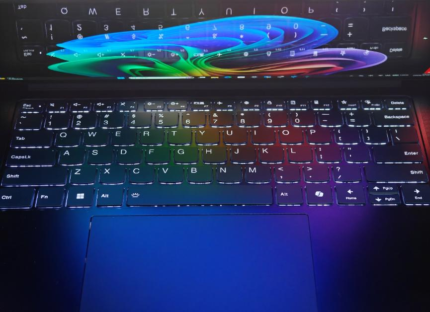
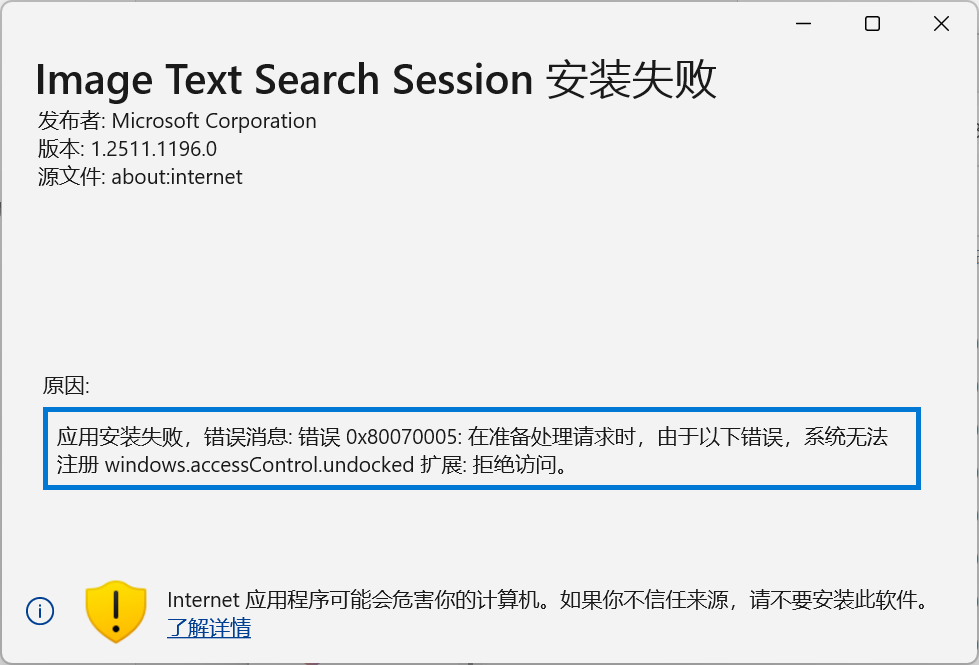
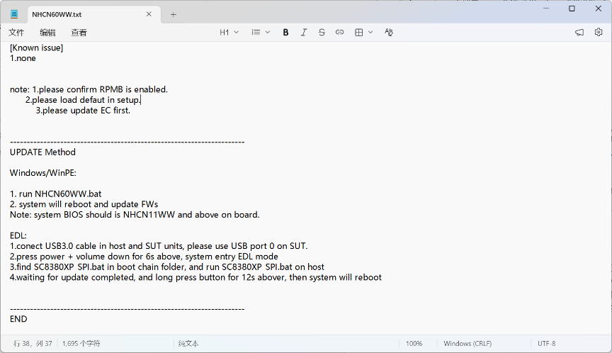
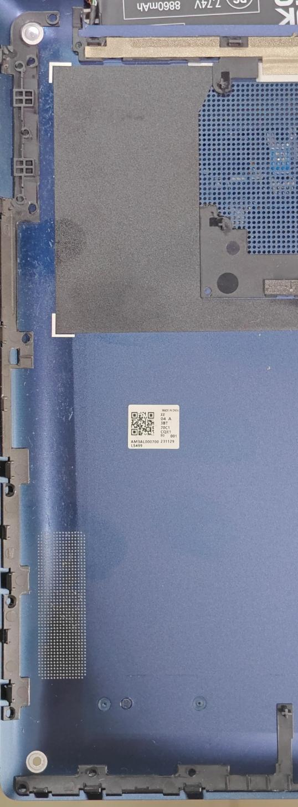
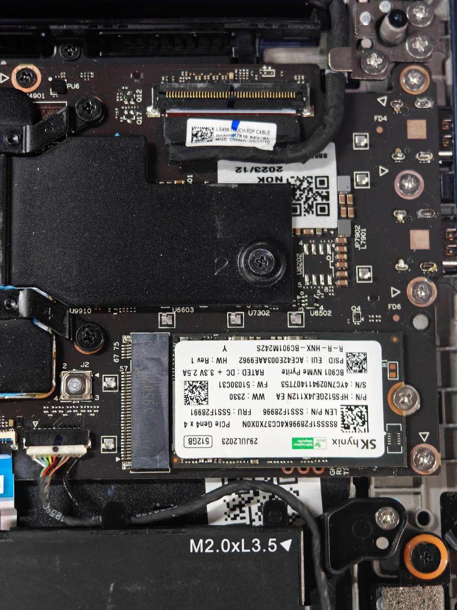
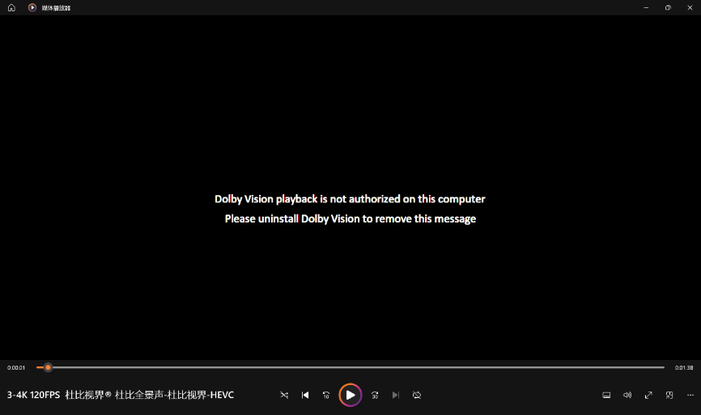
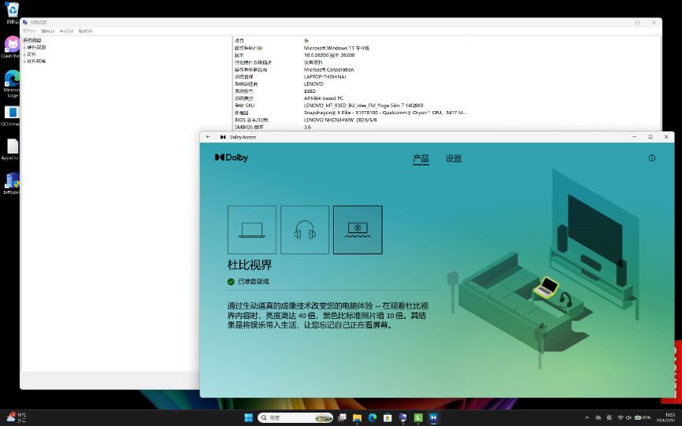

\---

title: Yoga Slim 7 14Q8X9工程机摸机小记

date: 2026-08-30

\---

众所周知在黄鱼，该机型工程机在一位贩子手上以16G内存一千九32G内存两千八的价格的挂着售卖有一段时间了，老板似乎有不少机器，但显然32g的没什么人要（贵了，要是这机器能自己加内存空机卖一千绝对爆），16g的卖的不少，毕竟一千九绝对是一段时间以来最便宜的X Elite机器。本小白也是买了一台，并且通过实践和研究从中了解到了一些消息，特撰此文与各位共享，祝各位搞机愉快。

1.基本信息

这批机器从外观上和正式版不能说十分接近，只能说差异不小了。A面是经典烂脑娃风味，属于上一代毁誉参半的设计，而非本代应该是的那个大Lenovo——另一个毁誉参半的设计。一般来说机器上会有一个大叉，标记这台机器已经核销成为垃圾可以瞬移……哦不是可以环保回收了。问题在于这个叉划破了阳极氧化层，露出了铝的原色，你可能需要一点贴纸来遮瑕。

B面还是非常惊艳的。OLED的窄边框和触摸屏的玻璃覆盖相结合，给了我们以充足的视觉冲击。左右上边框不算刘海半指不到，底部略小于一指。简单来说我们的烂脑娃在这台机器上用OLED做出了隔壁XPS用IPS就做到了的边框水平，但总归依旧是足够吸引各位眼球的。

C面可以看到正式版不会出现的经典印刷的键盘和烂脑娃狗皮膏药。正式版变成了新的键帽风格和Yoga的标，但是按键功能都是一样的，刷EC不用担心功能乱掉。

D面接近于正式版机器，但是印刷上保留了工程机风味，大量的占位符昭示了这是个工程机的事实。可能大家到手会发现有个角是翘起来的，这个我们后面再说这是怎样的一个小巧思。

我这个机器大概是23年底X Elite接近发布的时候组装的，整体已经算是后期了，经过测试可以刷正式版BIOS，机器本身应该没熔丝，熔丝之前关不了工厂模式，这意味着安全启动等功能难以开启，但是这台机器在抛去微软的AI的问题上表现得和正式版机器几乎一致。

2.已知Bug合集

虽说这台机器属于比较晚期的机器，但毕竟这是工程机，Bug还是有的，我把手上见到的Bug和我自己的的缓解方式随便总结了一下，供大家参考：

Bug1：开机按钮和novo键在没插电下没法正常开机。

缓解：插电再按按键开机或者翻盖开机。

Bug2：杜比视界没法开启。

解决：参照后文使用原厂工具修改机型到正确型号，再安装旧版本的Provisioning。

Bug3：USB4疑似不工作，Windows设置里面没有USB4中心。

思考：暂时没什么缓解方案，可能是少了一个BIOS芯片或者相关固件。但是至少全功能应该能用。

Bug4：安全启动开不起来

解决：应该进9008刷Fuse版BIOS就行，如果不玩微软的AI烂活也可以摆烂不缓解。

Bug5：充满电后会以一个稍快的速度自己掉电到95%后再充电。

吐槽：这机器似乎就是这样的……但也不排除是EC的锅。

Bug6：偶尔在窗体边缘会出现白色HDR的白块。

缓解：感觉和GPU与DWM有关，要缓解稍微移动一下窗口就行。

Bug7：没法安装微软在更新里面塞的模型并且会导致Windows更新反复尝试更新系统

求助：我也希望得到答案

3.9008和BIOS

众所周知骁龙笔记本本质上是大号手机，自然也有喜闻乐见的9008刷BIOS环节（如果是UFS的机器还能直接刷用户数据分区，9008装系统这块）。本来这个环节不应该出现在消费端，因为厂家肯定会好好的捂着自己的Firehose，但联想是什么厂家，是能把自家手机平板的BL用公钥签名的世外高人，于是乎这机器的整套工厂BIOS工具链就这么自己泄露了。

大家可以到这里下载最新的BIOS工具链：

<https://download.lenovo.com/consumer/mobiles/nhcn60ww.zip>

解压后BOOTCHAIN_NHCN60WW文件夹里面就是工厂刷写BIOS什么的相关的工具了。

NHCN60WW里面的txt文件教学了你应该怎么用这套工具，并且手把手教你了怎么进9008。但是大家还是很迷惑，这机器哪来的音量键，

我本来也很迷惑，尝试了电源键+F2无果。直到我突发奇想拆了机。这机器拆机也有意思，底面朝上屏轴朝外左上角那颗螺丝是装饰性的，实际上壳子上完全没有小平台供螺丝锁紧，这个角也常年是翘起来的，这个大概是方便工程师拆后盖的小巧思吧。另外这机器也是电池处还有个卡扣，记得撬棒探进去抠一下。

掀开底盖，然后就很轻易地看到了这么一个按钮

直觉告诉我这个外界接触不到的按钮应该大有来头，而且可以查到这个按钮在正式版是空焊的，于是试了一下果然是EDL组合键的音量下，于是乎我们得到了进入9008的方法。进而可以通过官方脚本（SC8380X_dump.bat）做BIOS的备份，也有官方脚本（SC8380X_flash.bat）将备份的BIOS刷回去。其他的脚本和工具以及9008玩法留待各位朋友自行探索，希望能看到各位的高见。

至于升级BIOS，用EDL升级还是杀鸡用牛刀了，用NHCN60WW文件夹里面的脚本和文件更新或者按下面的教程把型号修复了再走WU更新也是一样的。

4.刷号

奸商给机器型号写成了"Yoga Slim 7 14QNV9"，这个错误的型号带来了一系列不大不小的问题，包括但不限于：

Windows Update搜索不到驱动更新。

联想的杜比视界解码授权无法安装，通过其他方法装了直接拉闸。

这个可以通过重写BIOS里面的机器型号来解决。

首先就是下载最下面链接里面的"BIOS_Tool_Yoga_Slim 7_14Q8X9.7z"。如果希望懒人化那就运行"14Q8X9.bat"直接刷号就行。这里对于每句话干了什么做简单介绍：

Sudo是微软给的提权工具，我图方便就用了，如果出问题请自行开一个提权的cmd窗口然后分别执行sudo后面的指令。

Win64.bat /w /pn /c "Yoga Slim 7 14Q8X9"——这个部分是修改机器的Product Name，也就是BIOS里面显示的型号。

Win64.bat /w /fd /c "Yoga Slim 7 14Q8X9"——这个部分是修改机器的Family name，也就是系统SKU的后半截，有了这部分驱动更新和杜比视界问题应该能得到解决。

Win64.bat /w /mt /c "83ED0001US"——这部分意图修正机器的Machine Type，奸商就写了个"83ED"，这么写会导致不少地方显示奇丑无比，修正后应该显示相对正常了。

如果希望深入了解一下可以阅读一下里面的文档和脚本。比如你还可以直接修改这台机器的序列号使得这台机器"独一无二"，也可以把设置里面的机型改成机器型号，这个留做习题。

最后结果是这样的，系统SKU变成了"LENOVO_MT_83ED_BU_idea_FM_Yoga Slim 7 14Q8X9"，此时应该就能正常收到BSP更新和激活杜比视界了。

联想官网上最新的杜比视界安装包依旧可能出问题无法安装，这里我提供一个旧版本的安装包，里面有对应的杜比视界配置文件，安装了就可以正常点亮杜比标识了。

5.有限的体验

最后我在这里主观的随意聊一下对这款机器的有限的体验吧，虽说这是工程机但是说实在的这机器和正式版也差不了多少了，也可作为一定程度上淘二手的建议吧。

这款机器使用了一片14.5寸OLED屏，分辨率2944\*1840，支持90hz高刷，带HDR600 True Black和杜比视界认证。型号标记为LEN8AC2，具体型号被隐藏了，但通过一些手段了解到是ATNA45DC01-0 (SDC4189)。这块屏好像是给这款机器单独开的，最后在25年的14寸Yoga Pro 7上完成最后一舞。虽说是硬屏，角度大了会有彩虹纹，可能是屏幕体验依旧是极佳的，OLED就是这么美味。这套Dolby Atmos认证的四扬声器体验也是足够美味，高音甜，中音准，低音沉，在Windows这个范畴下水平还是不错的，两者相加绝对的小型家庭影院。

本机支持单手开合。屏轴稳定性一般，轻推会晃，大力摇屏幕会向最近的行程终点倒下。屏幕有磁吸，盒盖感应正常。机身刚性整体优异，键盘支撑极佳

Yoga在23年开始逐步地将自己的键盘键程加到了1.5mm。个人感觉键盘体验整体还行，整体打字的手感还是比较紧实的，有同样是1.5mm的ThinkPad键盘的风味，但确实没有登峰造极。按键表面做了一定的防止打油的涂层，后续效果有待观察。另外这键盘背光有四档：关，高亮度闲置暂时关闭，低，高。

整机重量标称1.28kg，实际上手感觉是1.3kg级别量级，考虑到这是一个14.5寸的没有可以做减重的机器，可以评价为重量适中。

待机功耗收到屏幕影响很大，如果亮度调到10%能够压到六瓦上下，而调到最亮就要接近十瓦了，所以这机器某种程度上并不是那么省电，续航全仰赖70wh大电池。

最后祝各位玩的开心。

