\---

title: Lenovo Yoga Slim 7x 14Q8X9 Prototype——Qualcomm Ruined Everything

date: 2026-08-30

\---

作为苹果叛忍和败犬高通的妄想翻生一战，X Elite首发可谓宣发无比浩大落地一塌糊涂——号称牛逼哄哄强无敌，PPT发布之后一直咕咕咕，等上市发现大人时代变了要打的不是M2而是M4了；原生性能评测结果仅仅和同期X86水平接近，一转译梦回2019甚至2009，功耗也完全压不住完全不可能被动散热；再一看高通不当人芯片出货价奇高连带着各家OEM定价飘得上天，结果自然是喜闻乐见的大暴死。然后高通不紧不慢端出了八核版的X Plus，由于外围太垃圾，核显解码拉一裤兜堪比Z8700，性能同价位谁都打不过喜提二阶大暴死，大陆市场名声直接臭了。好消息是好歹卖的比以往WoA多点，坏消息是之前的WoA可以说80%是华为一家在中国大陆卖的，现在一堆厂家卖机器那OEM不是亏的底裤都掉了。

作为亏得底裤都不剩的一个缩影，黄鱼上也出现了不少X Elite的骨折价九八新箱说全机器和工程机在那里流通，最便宜的工程机一千九，两千多的也不少，一般的也就三千多，四千多已经能买旗舰机了。放眼望去最具性价比的就是今天的主角——Lenovo Yoga Slim 7x 14Q8X9的0.2版Prototype，虽说宏碁那个机器的正式版价格和这个机器接近，但是粗糙的工模终究难以对本机的外围实现全面压制，可以说我就是冲着这机器的屏幕去买的。之前为了介绍这款机器到手之后可以在哪些方面稍微玩一下以期取得更加接近于量产机的体验加急赶了一篇文章，现在我们就来稍微精细一点的聊一下这款机器，看看高通和OEM做错了什么才导致今天这一地鸡毛。

**友情提醒：工程机有风险，每台机器的bug都不一样（比如我朋友拿到个EC版本低键盘灯不亮的），即使这批机器放工程机里面已经算是大bug比较少的那批了也有一堆奇奇怪怪的bug，除非真的闲的没事干否则请勿模仿。本文并不构成任何购买建议，在自己没任何操作的情况下就被工程机炸翻请自行找卖家撕逼，自己瞎搞被工程机炸翻请自觉找人修或者卖料板。除非有人试过了或者有后悔药，否则请不要去升级工程机的BIOS和EC。**

# 1.外观：烂脑娃终于会做一点旗舰轻薄本了

本机的基本外观情况在先前的那篇文章中已经用文字介绍了，给个传送门，这里就补充一下上篇文章没有加上的图片，毕竟文字还是有点苍白。

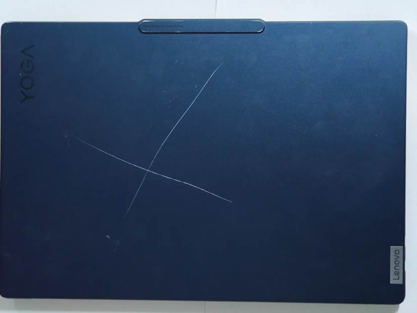

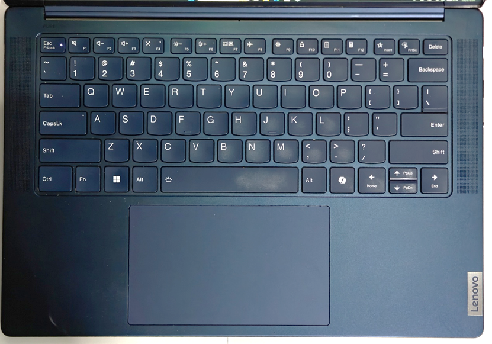

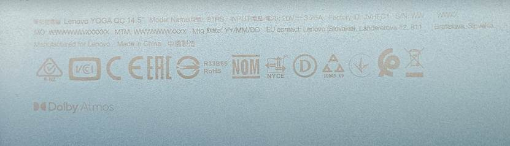

而有关量产机的更多的信息我们也可以去欣赏其他媒体的图片，这里就不去做过多的介绍，而是讲一点我的看法。

这套模具其实是单开的，虽说相比较于上一代Slim 7实打实的缩水了（上代是CNC这代变冲压了），但是依旧展现了一点旗舰机该有的精致感：珠宝设计使得机器无比的圆润和谐，机身上除去刘海没有任何锐利刮手的地方；精心打磨的水线让人惊叹于机器居然能如此之薄（当然实际上这机器也没多薄）；抚摸上去细腻的阳极氧化铝给人一种基本的品质感……可以看出联想在经过不停的训练后终于学会了一点做旗舰的方法，但真的不多，许多玄学的地方就没有表现出来（一些是烂脑娃自己缩掉了，一些是烂脑娃自己不会做），要是加上量产机那个Lenovo标真的是令人头痛（不代表原始的设计就不掉价了），最后成品还是一股ideapad味儿，Yoga在高端化道路上真的任重而道远呀。

# 2.屏幕：绝对的第一梯队

之前提到过这款机器可能使用了ATNA45DC01-0，或许大家会有一些疑问，我参考的资料是在这款机器上装Linux跑fastfetch回报的型号，然后SDC4189去屏库网查就是这个型号。对此我没法做出完全的保证，我有种隐隐的感觉我被瞎填的Linux设备树坑了但是没有证据，但是预期上其实差距应该不是特别的大，毕竟那时候已知信息也没去买国产的大尺寸OLED就是，就当是这块屏超了一下亮度。

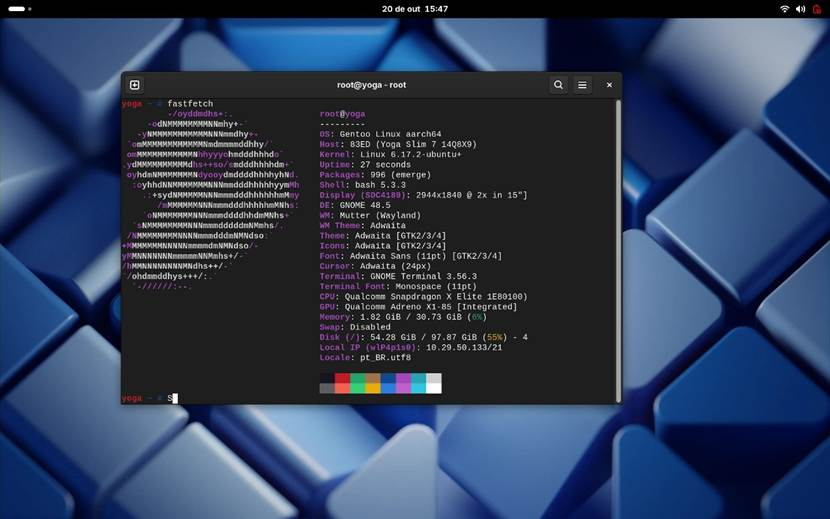

不管这些了，聊一下我的主观感受吧（要我测试客观数据我也没设备不是）。这块屏确实足够优秀，就是中亮度的时候略有木讷感。SDR亮度接近500nit，HDR激发亮度接近1000nit，放到今天依旧是一个足够优秀的屏幕。厂家在EDID里面标注107.4%的NTSC，属于各位喜闻乐见的广色域屏幕。屏幕过了HDR 600 True Black和杜比视界认证，拿这块屏幕看HDR内容真的给人以吃了闪光弹的感觉，真的贼爽。说实在的我为什么上这个黑车有一半原因是为了Copilot+ PC，为什么不去买宏碁那个公模正式版机器的另一半就是为了这块屏幕。虽说前一半遗憾沉戟，但是后一半可是实打实的得吃了，我很满意。

可惜的是这屏幕表面没有做任何的抗反射，屏一黑就是自己的丑脸出现在屏幕上实在是难崩，好歹你都是Yoga Slim 7了，还一点抗反射都不做又是何意味呢？不幸的是，我们的烂脑娃一直在这个送分题上反复出错，到现在烂脑娃应该也就ThinkPad那边做好了OLED的3A（部分16寸机器只有抗反射），实在是显得有点贱了。

顺带一提这台机器的屏幕是真的薄，整个屏幕组件大概就四毫米厚，屏本身大概就一半。屏幕相比较A面稍微内收，外围包了一圈塑料支架，但愿能提高在遭遇跌落事故时的存活概率。

# 3.输入设备：有提升空间，但真的不多了

联想从23年的机器开始逐步地在家用机采用1.5mm的键盘，不得不说这是一个很有趣的改变，特别是在ThinkPad那边已经切1.5甚至1.35的时刻，更尽显黑色幽默。之前提到过这个键盘的印刷和正式版不同，用的是23年的按键印刷风格，而Yoga现在的这个布局就是23年那一代定下来的基调。很多时候你会觉得这个设计其实参考了ThinkPad，比如类似于ThinkPad的手感和略作分区的Fn键区域；但保留了一部分自己的特色，比如半高方向键和依旧很家用的Fn区域设计。当然前面大家也观察到了，虽说目前的设计还是很像23年的键盘，但是已经有了万恶的Copilot Key，右Ctrl爱好者心如刀绞的一天呀。

虽说一般认为笔记本薄膜键盘键程一寸长一寸强，但是短键程的键盘经过专门的优化过后也能去摸优化不佳的上位者的屁股，所以这件事情还是得自己上手去摸才能下一个简单的结论。令人欣喜的是，从手感上，这个键盘已经有ThinkPad风味了，按键感受扎实有力，按下的力度十分的微妙，但还是有一点微妙的差距，当然这点差距可能是心态问题和牌子问题，总而言之这个键盘给我的感觉是愉悦的。

作为高端机，这款机器的键帽和机身做到了追色，值得好评。表面也做了一层涂层，应该不会一下子就把键帽就直接磨秃了，但可惜这个图层超级吸油，加上键盘是深色系的，打一下字就满键盘油花，稍显难受。另外这个键帽有一个很神奇的特性，就是你正视时是深蓝色的，但你一歪脑袋从边上看过去就神奇的变浅了，有趣。

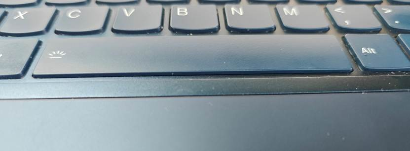

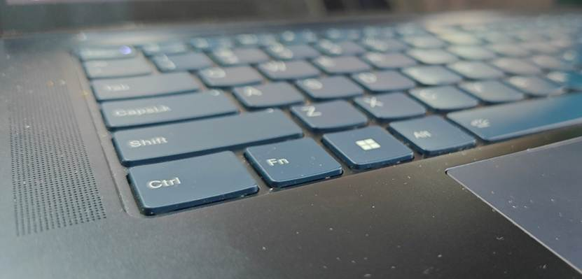

触摸板是玻璃的，或者说同价位不给玻璃的大概就ThinkPad这个拿这个嗯区分产品线的二百五了。可惜的是这块触摸板并没有做成压感触摸板，这决策放在2024年倒还算是可以接受，但还是显得有点小气。这触摸板在翘翘板中也算翘楚，大约80%的触摸板可以被按下，其中大约80%你可以相对轻松的按下，点按手感放在跷跷板里面属于上乘，滑动反应灵敏跟手，面积也很大（135mm\*80mm），基本上可以勉强使用它作为主要的指针移动方式了。就是点按声音聒噪，甚至比我那个S2的破烂塑料板还吵，实在是掉价。触摸板的AG做的很滑，和ThinkPad那种稍微粗糙一点的摸丝袜的感受不同，我个人更喜欢摸丝袜。

这款的触摸屏支持十点触控而不支持笔。肉眼看上去并没有很明显的纱窗感，但是手电打上去依旧能看到一些网格。表面做了一定的抗污处理，但滑动仍然稍显生涩，该沾染的指纹和灰尘一样沾染，所以说该避免使用触摸功能的的时候依旧应该避免使用，应该将其作为一种辅助而不是主要输入手段。

# 4.体验杂谈：Windows On Arm行了嘛？如行

由于这台机器的Copilot+ PC体验相当缺失，这里就不聊那些微软的AI了。但是可以确定的是这机器的NPU不是电阻，工作室效果等小效果是能开的，就是微软放商店里面吹的那三叉戟没一个能用，主要原因是模型莫名其妙被拒绝安装和没熔断的机器开不了安全启动。

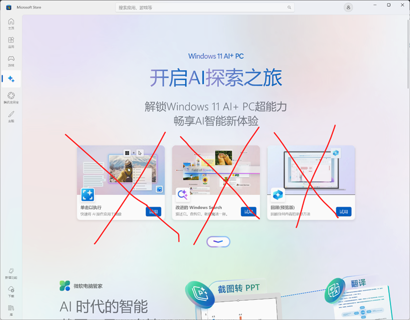

至于实际体验，本人不是专业的跑分测评博主，用到的东西也不多，再加上工程机数据和实际到手体验可能完全不同，这里主要就是简单的扯一下我自己的感受。

首先是转译性能，这机器的转译后单核性能接近于频率较低的SkyLake，多核大概5800H水平。你说性能落后卡的没法用肯定是扯淡，但是你说完全好用也是鬼扯，正常用嘛当然也是可以凑合的，但就是怕什么时候忽然死给你看。如果再考虑到arm原生软件那么个数量，那么我们似乎应该drop it而不是陪Q公子玩了。

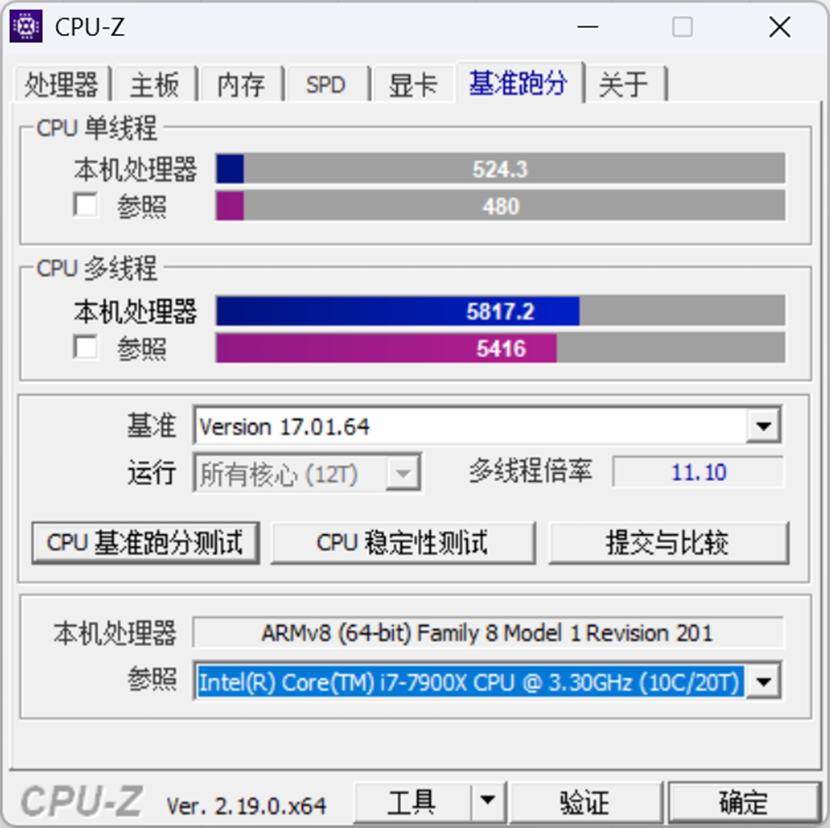

再来说原生性能，看起来这个原生分很高，和谁比都五五开，Nuvia团队确实有两把刷子，但问题是我们真的能在大多数时候应用上这个并没有比同期x86处理器强太多的原生性能吗，而转译后的性能大家都知道，视情况大约在5800H和L2400之间疯狂波动，键盘值实在拉稀呀。

这种高通做了点有趣的玩意然后因为步调踩错被IA莫名其妙碾成烂泥的场景不知为何始终萦绕在骁龙本的头顶上。高通刚做PC处理器的时候是计划上一代处理器当低端，然后850上的时候835甚至850自己的理论性能已经被IA两家核战争中碾成烂泥了；8cx上的时候850早就是路边一条，只能给寨厂清仓和Intel的N泥地摔跤的水平，然后高通做了7c和8c俩低端，结果一个因为性能太差劲风评奇臭无比，一个和8cx规格差太少了没拉开差距结果就ideapad 4G搭载；到8cx Gen3时代高通终于勉强能让8cx Gen2当低端货了，再补一个性能接近的778g改的7cx Gen3给某些想要便宜5G的厂家（比如三星）做机器，整体做的还行；估计高通本想稍微蛰伏一下等新核心做出来震惊一波各位，结果从8cx Gen3到X Elite这几年IA两家开打IPC大战，两家的IPC都暴涨一波，高通本来想做个多核达到M2到M3水平的U进而通过转译得到一个合适的性能，结果等上桌直接成小丑，实在令人忍俊不禁呀。

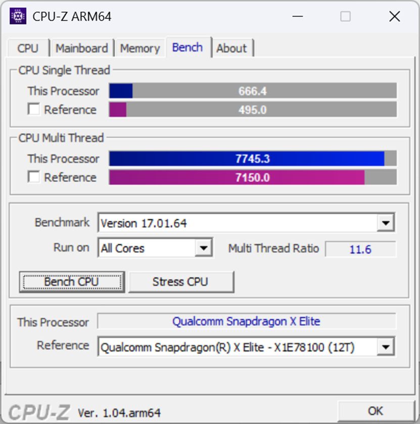

GPU性能上看这个规模就应该死心了，即使超冒烟也赶不上IA两家的核显的。简单跑了个原生的night raid，成绩如下。

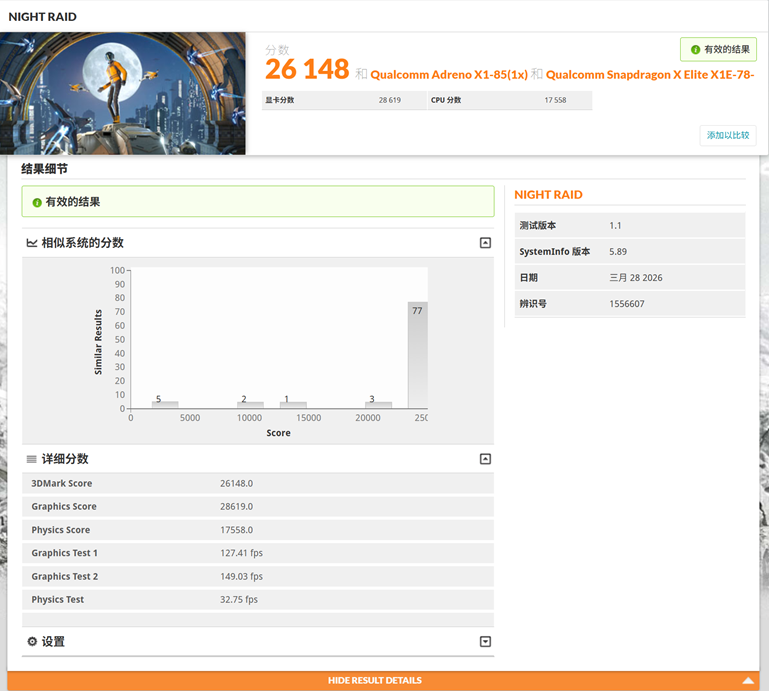

作为可能在这类机器上跑的"轻度"游戏的代表，使用最新的微软编译的原生OpenJDK跑26.1的纯原版minecraft大概能做到全默认设置目力统计Low帧能在60帧以上，大多数时候都是80帧+，另附带渲染错误若干。

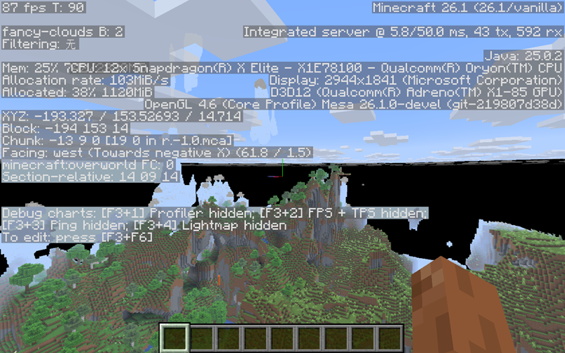

看高通的显卡更新日志高通应该还是在努力提高兼容性的，但一边是确实你原生游戏太少，一边是大家对高通不熟，再一个是高通的显卡规模还是过家家了点，只能说任重而道远。

关于硬盘，从最后零售机的奖池来看，这款机器能从PM9c1a，BC901和美光2550里面抽一个。理论上头等奖肯定是接近满速的PM9c1a，但是整体上这仨盘水平都不错。我这个工程机抽到的是BC901，CDM成绩就是差不多是一般路过4.0 Value盘的水平，盘整体来说不是什么大问题，就是PM9c1a水平过高，有八成Performance盘风味，这种混用还是显得有点性能差距过大，和原厂与杂牌混一样容易出舆情。

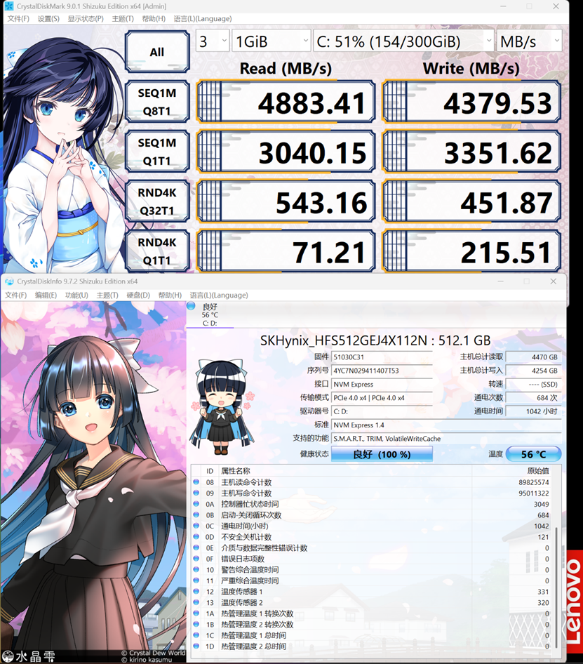

当然我朋友的工程机抽到了BG6，这个嘛……祝好（悲

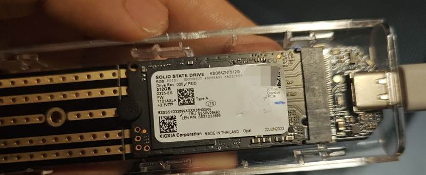

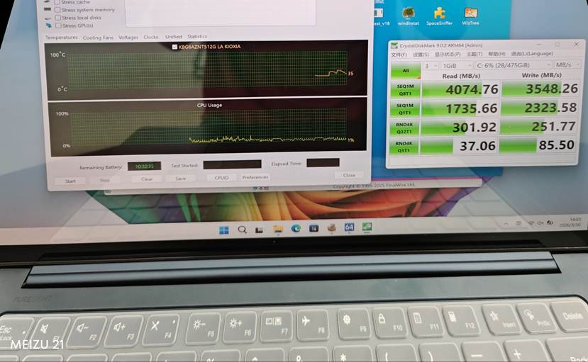

从实际体验上，我的期望这是一个以影音体验见长的文书机器，实际上这机器做到了，只要阿三不犯大病，那么这个机器凭借这块OLED屏和四扬声器绝对是超额完成任务了，可能某些二货平台因为分辨率原因不会给4K，但也够了。

那么为什么说"只要阿三不犯大病"呢，因为在装了26100的三月的带外更新后，这机器的基于Media Foundation的播放器和浏览器的HDR直接罢工，基本上只有SDR映射了，临时解决方案要么卸载更新要么装个K-Lite用里面的MPC-HC凑合一下。讲实在的修个微软账号不能登录能把HDR修炸了也是千古奇闻，哎，为什么阿三的事情总是这么糟糕。

由于种种原因，电池续航不是这回X Elite的重点，本来就是想着打赢同期IA两家就能赢，没指望和苹果一起竞争。我这里正常满亮度亮屏轻度负载下大概消耗10-15w，这种工况下配合70wh大电池续航约6-7小时。对于OLED，建议是将亮度调低一点，可以节约大量电量供CPU等使用。当然工程机可能调教有问题，如果功耗偏高也是正常。

# 5.总结：我给出多高的溢美就说明这机器多可惜

我自己是很喜欢这个机器的，觉得这个模具就是为了X Elite量身定制的，整个组合下来可以说是惊艳的家庭娱乐本，可见烂脑娃是用心做了的，不像不少家那样的应付了事，在买到手后这个情感更加的强烈了。即使这个机器是一个工程机，按说没法按照正常电脑去用，Copilot+ PC的特异功能也没吃到多少，但是这台机器工程机阶段就已经达到的出乎意料的完成度又弥补了这一点。但是我对这机器多喜欢我就对这机器摊上X Elite这位大仙感到无比的可惜。

一个个人电脑产品在中国大陆风评完蛋是一个风向标，基本上意味着这货从产品定义开始就是错的。小众产品只会没有声音，垃圾产品声音也不是很大，只有做错的产品才会炸个大的。不幸的，X1E就是炸了个大的那种，现在大家都知道WOA垃圾了，但问题是WOA是真垃圾的时候反而没什么声音，这就是小众产品妄图冲高破圈的悲剧。8cx gen3及之前的WOA芯片有个很奇特但是真的存在的市场是要求超长续航的轻办公人群，此时上高通真的是又省电又凉快还一般会送个基带，但是X Elite过分执着于和同期x86比性能，低频一坨稀，峰值性能也没打赢，转译又存在必然损耗，还没法被动散热吵死，甚至没几家买了高通5G基带做Always Connection，最后看起来名声臭了完全失败。况且在当年Matebook E Go定了一个高通没法接受的价格，把国内对于高通本定价预期彻底打折了（顺带坑了小米），结果X Elite首发灾难的定价搞得大家迷惑完了，也就宏碁那个机器虽说各方面都拉但是确实是个好的守门员，加上T14s有ThinkPad标大概能比一般机器加价两千不引起弹压，而且大概是国内X Elite机器里面唯一可选wwan（国内上不上是另一回事）的，其他机器基本上是梦游时定的价格。最后42100这个解码能力堪比Z8700的玩意出来更是把风评拉爆了，安蒙大概人都傻了怎么老钟这么多人有放4K60视频需求，最后发现是东亚弹幕文化的超绝助力叠加哔哩哔哩弹幕引擎写的一坨和大家真会拍4K120的视频甚至用AI超分插帧出一个假的一塌糊涂的高规格视频时大概直呼上当……还有唯一指定串子华硕，42100卖9999真的哄堂大笑，Surface Pro 12寸都没敢这么卖呀……然后X2E目前来看还要狂飙突进，X2EE这疯了一样的规格是打算做Arm移动工作站吗？X2E目前看要继续冲高端，但给高端机补贴补得过英特尔吗？还是说你能让X1 Carbon上高通？第三就是高通刀法一坨稀，X2EE和X2E还有X2P的鬼畜刀法不论，42100那个外围砍的亲妈都不认识的Die真的不如用8Elite的Die……高通当务之急是赶紧搞个价格合适规格凑合（至少解码能力打过hd620呀求求了）的低端芯片（令人惊喜的是X2P虽说规格砍的无比神经刀但思路确实还行，看起来最低配的42100就是桌面特化的8E5级别的处理器，如果能标定600刀左右的位置将会极其趣味，X2P和X2E之间的空隙可能用X1E来继续补充，但是这个大概做不到），而不是傻兮兮的冲高，高端笔记本的水比大家想的深，AMD都没成的事情高通就别扯了……鉴于此，再考虑到许多人希望的英伟达的一贯嘴脸，我可以骂一句woa要是再这么下去在大陆市场大概已经完蛋了，希望能打脸。

大厦将倾，但尚有拯救空间，如果WoA完蛋，那么XE将会是最后一根稻草；而如果WoA成功，那么XE将会是路上校正路线的一个小小挫折。是非功过就留待未来来评说吧。