---

title: ThinkPad 11e Yoga Gen6——从娃娃抓起

date: 2026-09-16

order: 1
---

ThinkPad 11e Yoga Gen6——从娃娃抓起

自打2008年推出X100e开始，ThinkPad长期在"类上网本"的赛道上发力，旨在给喜欢上网本体型但嫌上网本卡慢的用户提供更加尊贵的上网体验。随着上网本门前冷落鞍马稀，这个产品线也转向了K12，并且在2020年的ThinkPad 11e Yoga Gen6上完成了最后一舞。

当年这款机器推出的时候，还是引起了一点点微小的话题度的，毕竟联想拿出了一点奇怪的贴纸——25周年纪念机用过的彩色贴纸——贴在了这款机器上，以及K12机器经典的缺指点杆。不过这么点热度很快就下去了，现在在互联网上关于本机的消息可谓寥寥。而到了2026年，这玩意靠岸也靠岸了个七七八八，我想我们可以聊聊这个机器了。

# 1.外观：K12外观

鉴于大家可能对于这个机器会长什么样还没有一个清晰的认识，这里大家先看一下PSREF的图片，然后我们再来聊设计。

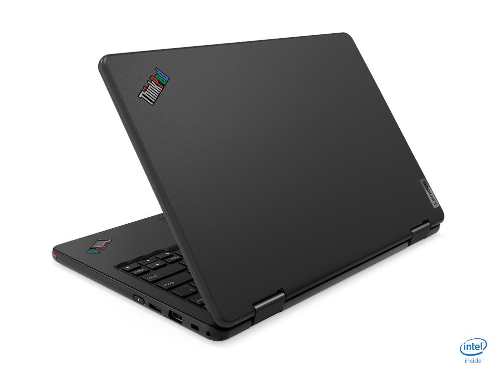

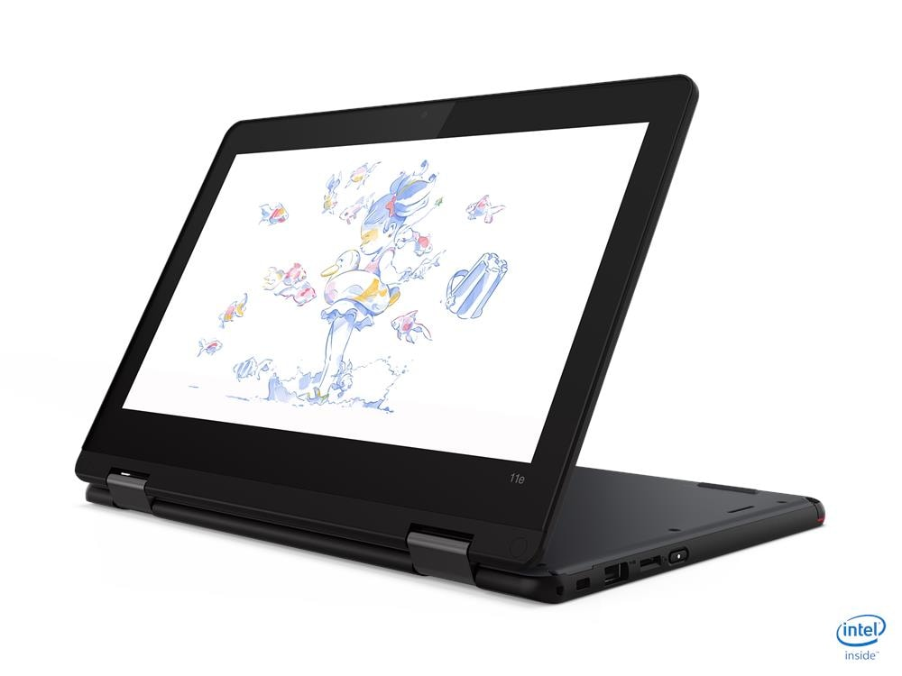

面对这么一个外观，我的评价很简单——外观很K12。

欧美的K12教育机对多数人来说比较陌生。其设计逻辑很直接：面向高频、粗放、长周期使用，优先保证可靠性和抗跌落性。具体到外观，就是厚实的塑料机身、塑料或橡胶包边，以及明显宽于同尺寸消费级产品的屏幕边框。整体观感不精致，但耐用性取向非常明确。

这种风格在海外反而有一批非目标用户拥趸。他们看重的是"加固"属性，但不希望机器把三防写在脸上。K12机型恰好提供了这种低调的结实感：看着像普通笔记本，实际耐造，日常使用心理负担很低。甚至能衍生出一种废土叙事——核爆后的废墟上，一个 Nerd 掏出又小又重的 K12 机器，就着核子可乐继续干活。画面确实有点帅。不过回到产品本身，这类机器的核心仍是抗摔、可靠和低成本维护，而非性能或精致感。

A面的永久性划痕虽然多，但是基本上都不是到肉的。每一个痕迹都代表了一段往事，可惜我不知道他的故事。同时我们也观察到，机器的右下角出现了Lenovo的金属铭牌，本机也是第一款有这个金属铭牌的传统形态的ThinkPad（或许在某些人眼中真正的第一款是X1 Fold，但其是在牛皮上压了一个Lenovo标，且不是传统笔记本），这个差评如潮的设计将陪伴我们较长时间。

我这机器A面上刻有"Property of Klein ISD"的字样，经查Klein ISD是德州的一个学区，学区内的学校可以完成从学前班到12年级的教学，正好覆盖了完整的"K12"教育。

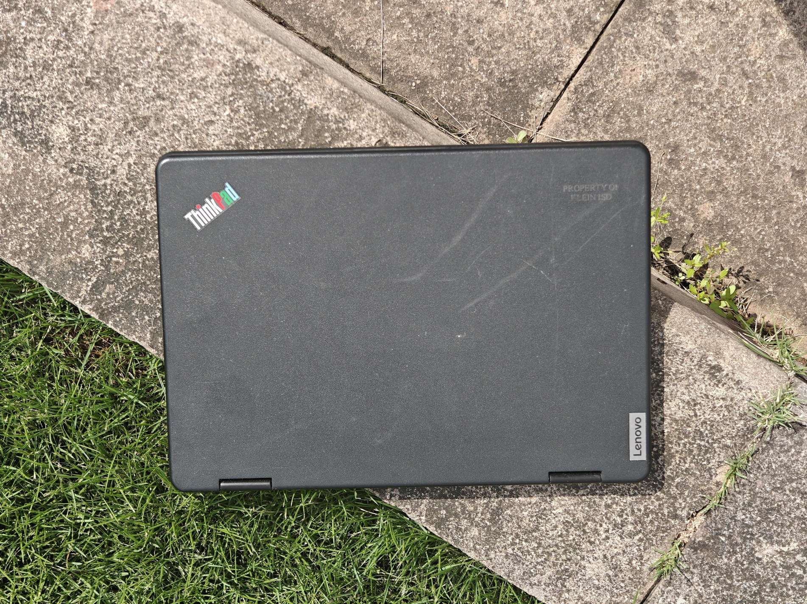

B面平平无奇，只有若隐若现的跑马边框吸引着大家的目光，也没有当时已经普及的ThinkShutter，这点还是令人诧异的。

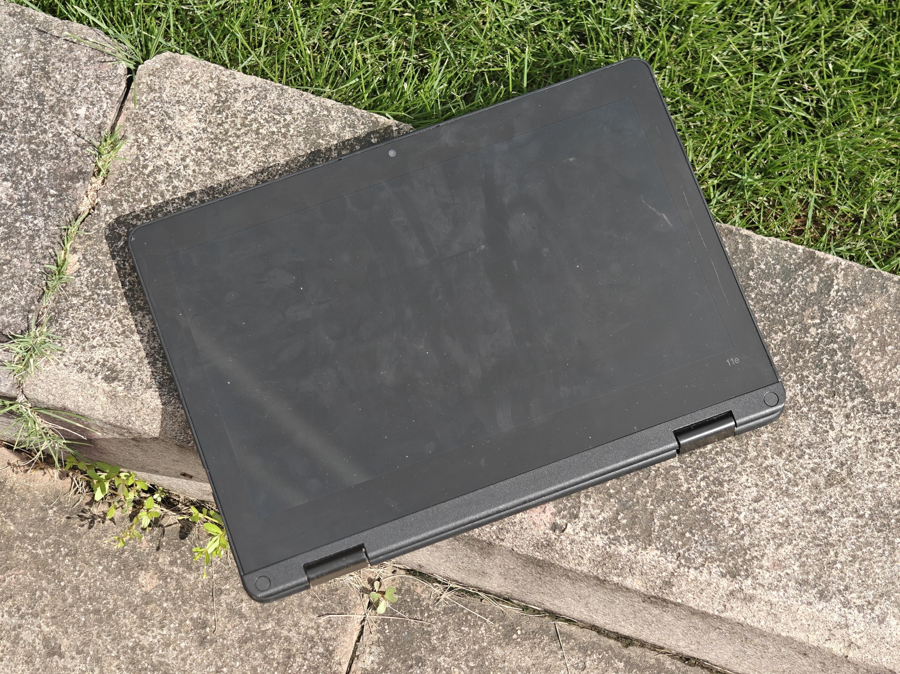

C面留到聊键盘的时候我么们再详细去说。值得注意的是，该机器可选C面的"World-Facing camera"摄像头，这个也在后续的ThinkPad偏低端的Yoga机器上普及开了，可惜本机并未配备。

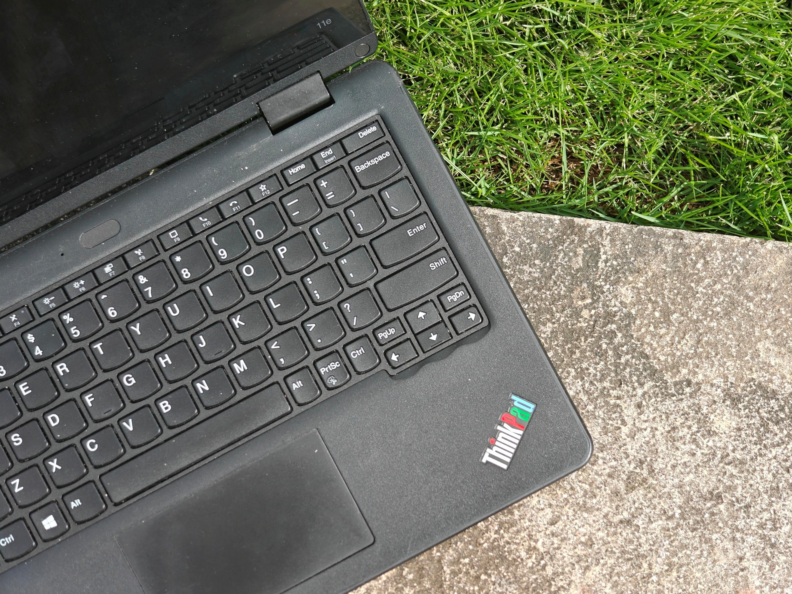

因为是无风扇的机器，D面采用Clean D设计。我这机器脚垫丢的差不多了，稍显邋遢。

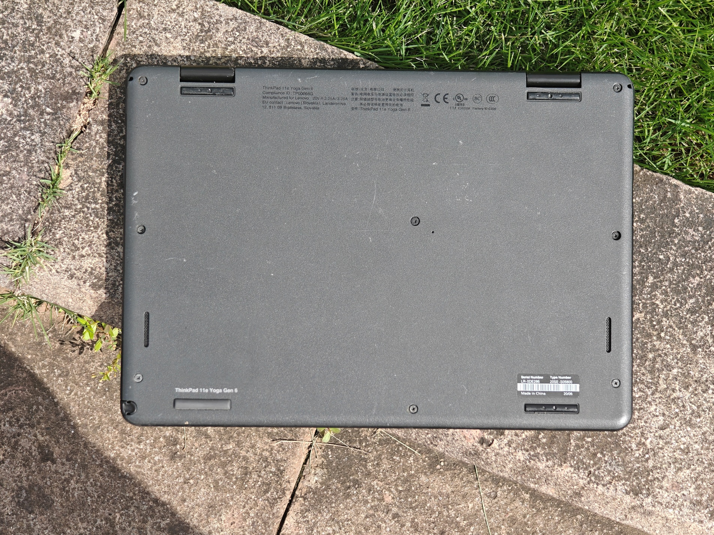

# 2.外配和接口：毫无惊喜，亦无惊吓

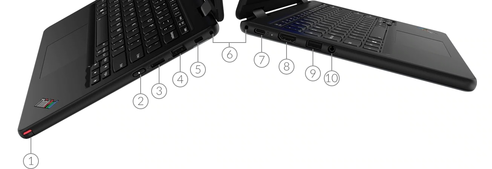

接口上这种机器就没什么惊喜了，一个5Gbps的全功能C口，两个5Gbps的A口，一个HDMI 1.4，一个耳机孔，一个TF卡槽。相较上一代少了一个网口和一个方口充电口。

速率方面，这个机器还是很有诚意的，Amber Lake受限于祖传22nm PCH的桎梏，自然无法如采用全新14nm PCH的Whiskey Lake给出10Gbps接口，但全USB3.0设计显然比配凑数USB2.0实用多了，

只给一个C口本身无可指摘，当时的低端机器都是这么做的，直到去年不少K12机器甚至还只有一个C口，但是作为K12机，我可能会希望厂家保留一个可靠的充电接口，而不是仅仅保留一个耐久欠佳的C口作为唯一的充电口。

HDMI是 1.4受制于核显也没有问题，但更高规格的HDMI可以用DP转接，但是这对于OEM来说还是偏脱裤子放屁，没做情有可原。

砍掉的网线口可能是考虑到这个模具只做Yoga本，加入网线接口和终归还是要追求一些移动性的Yoga是八字犯冲的，再加上本机要做薄，于是乎砍了。

回过头看，11e 能给出相对均衡的外围配置难得可贵，而同期的 E 系列却在接口上明显拉胯。E14 Gen2在更大的机身上搞出的那个令人哄堂大笑的1C2A 本身已经够紧张，其中一个 A 口还是 USB 2.0，这种组合实在不像经过认真推敲的产品定义。作为对比，11e 至少把该有的接口都给到了，E 系列反而在基础扩展性上开倒车，难免让人怀疑当时的产品经理到底在想什么。没有对比就没有伤害。

# 3.屏幕：统一分配的垃圾玩意

虽说2020年那个时候Think已经有了一些好屏，但是作为一个K12机器，这个机器只有一块很K12的屏——一块11.6寸，1366\*768，250nit的IPS屏。

我这台机器的屏来自京东方，型号是NV116WHM-N45，联想的LEN代号是LEN40D2。屏幕Datasheet上标出的可视角度是85°，色域是53% NTSC，71% sRGB。

从主观观感来说，这块屏幕的观感其实还行，虽说这个本身是建立在下限高的基础上，但是总归和别的垃圾比还是太甘霖了。说实在的，这块屏幕无论多么差劲总归是一块IPS，即使这就是最差劲的一档IPS综合水平也是远远强于同尺寸的TN屏。同价位的TN是什么水平？发白的屏幕，具有随便倾斜一下就看不见屏幕内容的"防窥"技术……大家脑海中肯定会浮现出这些形容。这里我就和同价位同类机器的TN屏做一个简单对比，给各位一个直观感受。

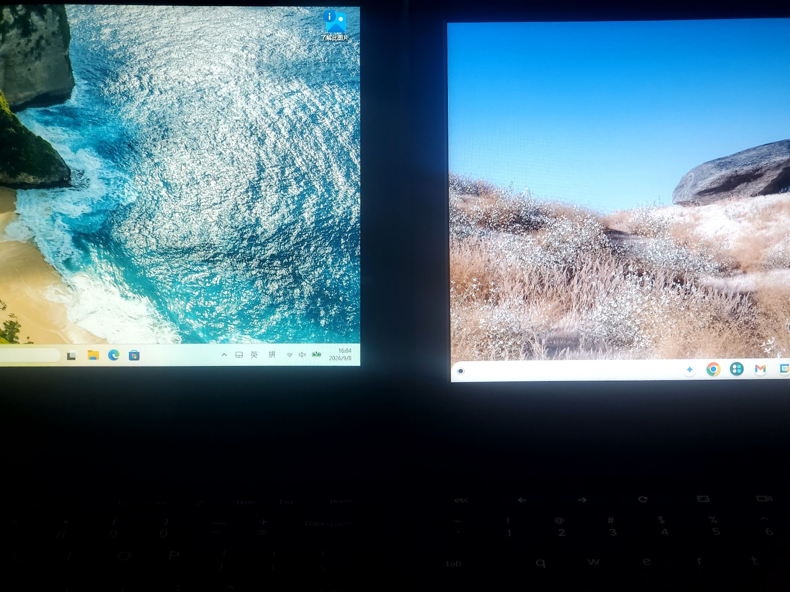

正面来看，图片中的其实两者的显示效果还是接近的，但这也是镜头下的骗局，因为你其实很难这么正的对准屏幕。

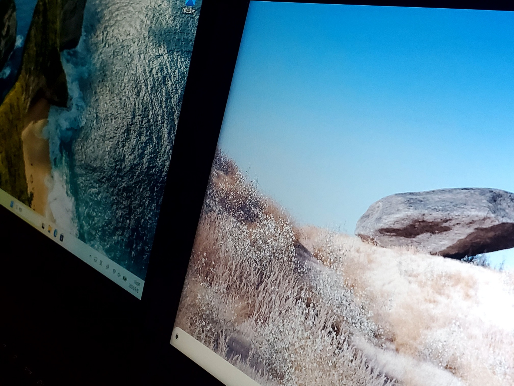

侧开一个角度，或许是供应商的原因，反倒是IPS屏出现了亮度衰减，而我们的TN显示依旧明亮。

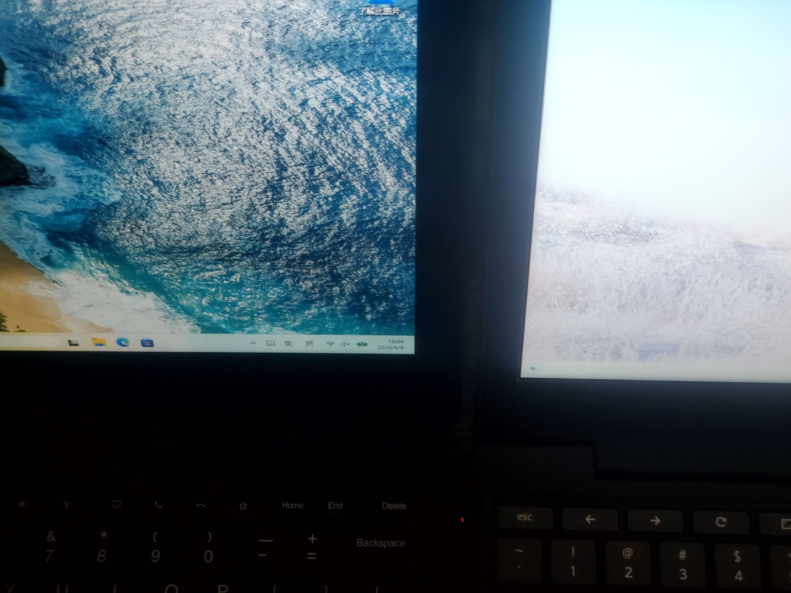

以上的场景我们的TN都没有输得很惨，甚至有几回合还小赢了几回。但是当我们调整视角，从上下角度去观察这两块屏幕的时候，马上就出现了很符合刻板印象的偏色问题，可以很明显的看到，当我们以一个常见的俯视视角看的时候，IPS保持了基本的显示效果，而TN屏这边已经是严重发白了。

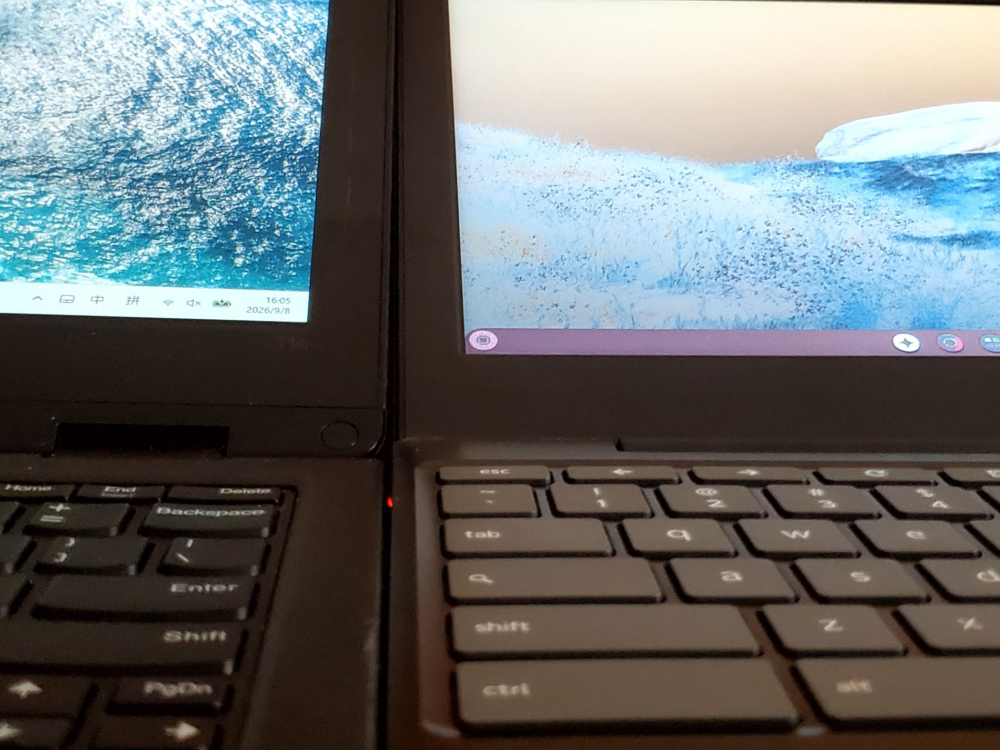

切换到一个仰视视角，情况更为糟糕，IPS依旧保持了正常的显示输出，而TN这边已经严重发黑了，出现了严重的偏色，基本上难以实现对屏幕的正常观察了。

至于1366\*768的阴间分辨率，我自己是不想吐槽什么了，毕竟大家都这么个样子，你这个太离群也不好对不对，不仅要多花钱定制屏幕搞不好还得不到市场的热烈响应，不如就这样摆烂，至少不是屏幕的错哦……

总而言之，本机的屏幕虽说上限不高，但下限还是勉强保住了。ThinkPad在11e的Yoga版上还是一直很舍得上IPS的，这也不好说是不是什么智慧，但总归是一件好事。

# 4.键盘和指点设备：略有复古感，但足够现代

作为一款K12机器，为保护孩子们的安全，防止真有瓜娃子把指点杆帽扣了吃了，本机和其他的面向K12的ThinkPad一样没有搭载指点杆系统。即使这个机器因此显得很不ThinkPad，让人很容易怀疑这机器是不是联想随便搞了个机器刷漆得来的骗钱玩意，但是他的键盘和触摸板依旧保持了ThinkPad的水准，一上手就知道这是ThinkPad，绝非低端K12机常见的垃圾键盘触摸板。

因为模具的更迭，本机键盘并没有沿用上一代的键盘，而是单独开了一块键盘。按键布局也采用了2020年的最新最时尚风格，F9-F11键变成了信息，通话，挂断。作为ThinkPad的低端机，本机键盘没有背光。

或许会有好事者发现，这个键盘的布局其实是很接近于六行巧克力版的X60键盘的设计风格的。

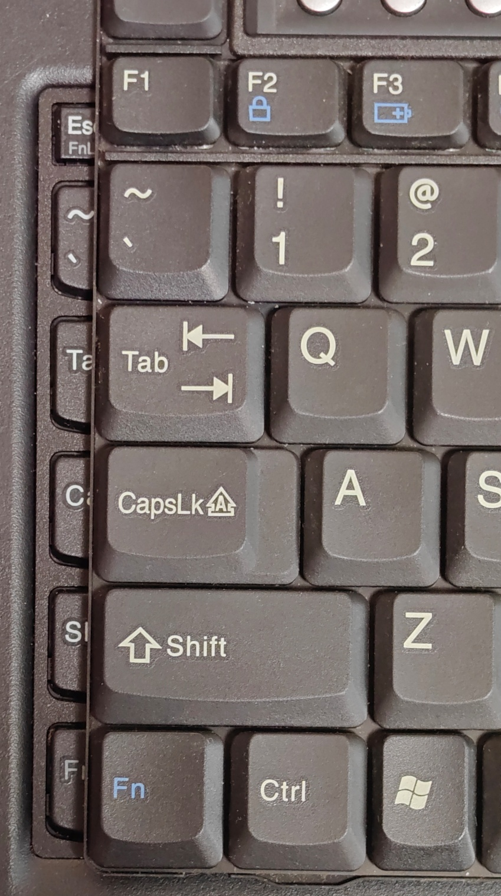

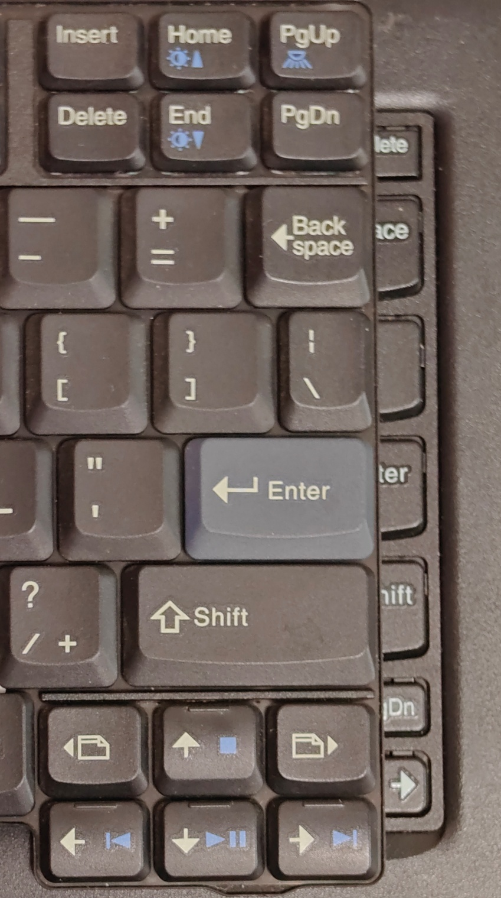

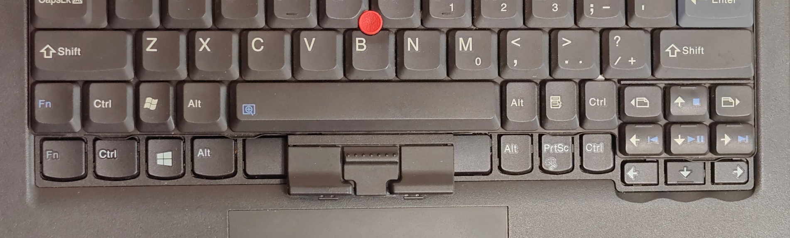

如图所示，本机的键盘和X60的键盘的许多按键的间距都很接近，设计思路上均为挤压两边空间来匀出中间字母区域的思路。这个设计和前几代11e机器的设计不太一样，前几代基本上是对X系列已经缩小了的键盘的二次缩小，本代机器采用这种回溯性的设计思路确实是一个小惊喜。

有趣的是，这款机器的键盘边坡度既不像近现代Think机器一样采用一个简洁的坡度，也不像现代扁平三键的机器一样采用陡崖设计，而是采用了复古的圆弧坡度+方向键处三个指肚凹坑的设计。这不仅从视觉上这个机器的这些曲线变得更加柔和，某种程度上也更加的复古了，确实让人梦回那段旧时光。

本机也是ThinkPad最早的一批1.5mm键盘的机器。键程的削减虽然可惜，但是Think团队对于键盘打字质量的追求依旧体现在了本机上，虽然没有背光，但依旧展现了经典的ThinkPad 1.5mm键盘风味——脆，回弹有力，反馈刚强，和传统的键盘出现了风格上的变化，但是却更加切合于较短键程下的打字舒适点，让人打起来很舒适。

本机的触摸板不出意外的是塑料板，但是11e即便属于低端ThinkPad产品也不含糊，其表面的涂层依旧是21世纪20年代中低端ThinkPad的正常水平，高于一般的低端甚至中端机器会用到的塑料触摸板。其触摸板微动相比较于更早的型号换用了后续机型会使用的更加安静的型号，点按起来质感十足。

至于触摸屏，本机的触摸屏采用了Wacom的AES技术，支持AES手写笔，本机也内置了一根手写笔。在宣传材料上，本机宣称也支持用2号铅笔进行触摸操作。

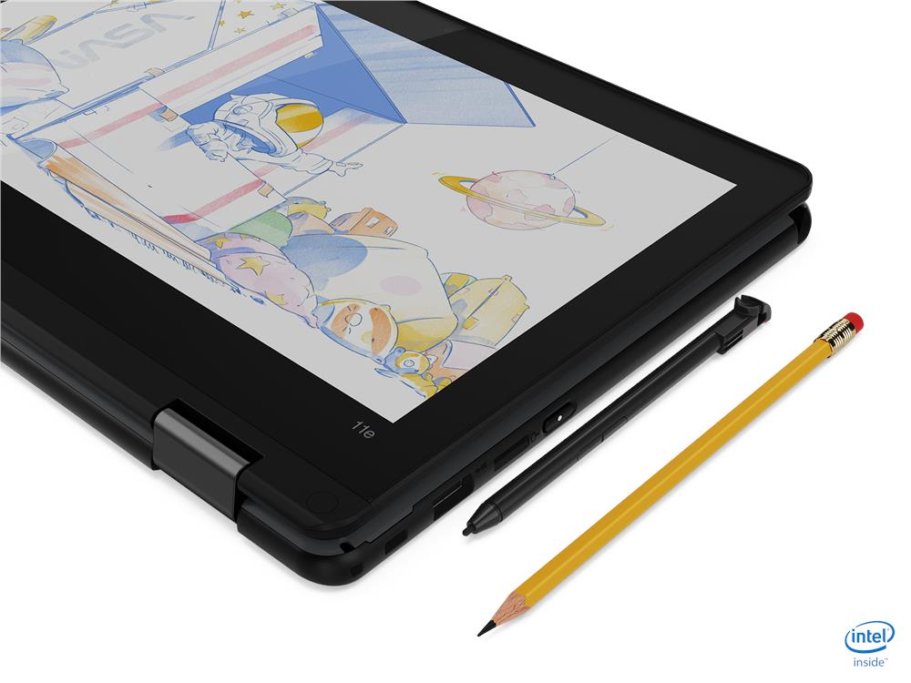

从触控笔方案来看，AES 在非纯触摸方案里属于体验下限偏低的一档。这里不评判技术路线，也不分析算法调校，只谈一个对实际手感影响很大的设计：橡胶笔尖。

主流触控笔通常采用塑料笔尖，追求书写手感的则会用毛毡笔尖，而 AES 阵营有大量产品——包括本机内置的那支"牙签笔"——都使用了橡胶笔尖。要我说橡胶笔尖并非绝对不能用，但它对屏幕表面的顺滑度要求很高。问题在于，本机玻璃没有疏油层，表面阻尼本来就偏大，两者叠加后摩擦力明显增加；更麻烦的是，屏幕沾油后不同区域的摩擦会变得不均匀，落笔前很难判断哪里滑、哪里涩，进一步恶化书写体验;再加上笔尖偏粗，基本无缘绘画创作，做笔记亦体验不佳，只能满足儿童用户的随意涂画需求。

至于二号铅笔（也就是我们熟悉的HB铅笔，并非是望文生义的2B铅笔）当手写笔的宣传，我试过了，是真的。虽说这种触摸肯定就是纯粹的触摸实现，没有压感支持，但是其存在本身就令人感到有趣。

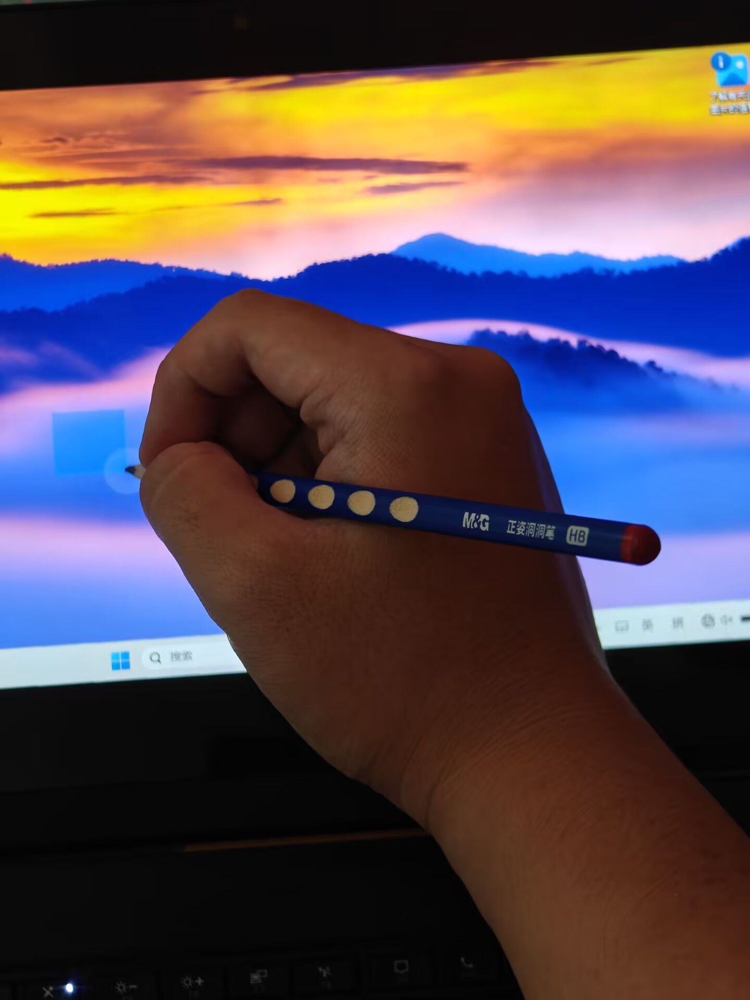

# 5.性能：还是K12机器的翘楚吗？

本机发布于 2020 年，却搭载了一颗 2018 年的老处理器——m3-8100Y，代号 Amber Lake-Y。它的规格为双核四线程，基准频率 1.1GHz，单核加速 3.4GHz，全核加速 2.7GHz。放在 2020 年的低端市场，这套配置并不算罕见，性能上也不是相当落后，但问题在于，当时英特尔已经拿出了四核 Amber Lake-Y 和 Ice Lake-Y，这时候再推双核 Amber Lake-Y，多少有点显得生不逢时。哪怕因为已经定版无法修改主板，只是给机器换个马甲处理器，刷到 10100Y，至少面子上也更好看一些。

从核心规模，PCH和封装来看，这个处理器本身更多的是Kaby Lake-Y套皮，在性能方向也是一眼能望到头。但拜Atom演进速度慢人一步，现在的K12机广泛使用的四核Alder Lake-N处理器性能基本位于7200U和8250U之间，显得现今8100y仍不算差。

在CPU-Z中，本CPU喜提单核291多核753的成绩，跑分时机器顶着8w功耗墙跑，勉强算是正常。

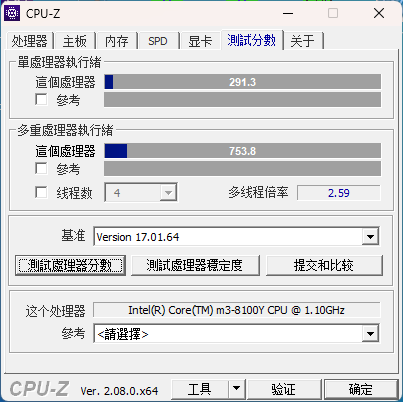

7 Zip可以测试设备的短时爆发型负载，我测得的成绩11422，基本持平6200u。没有惊喜，也谈不上翻车。

Speedometer 3.1用来测试设备的网页浏览能力，经过测试，得分10.9分。

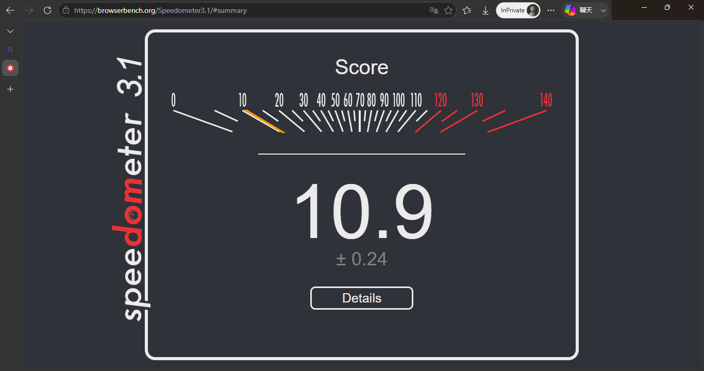

3D Mark Steel Nomad Light得分187分。

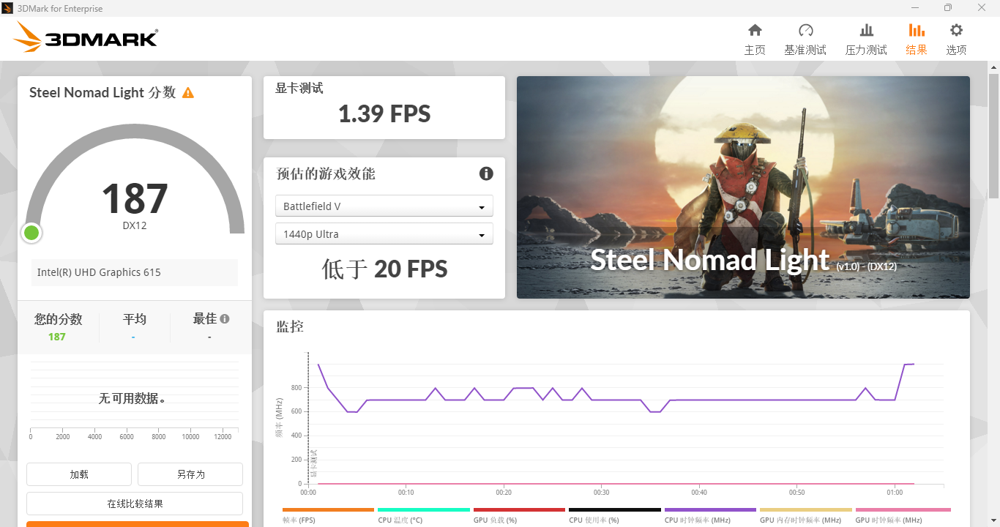

3D Mark Night Raid得分为2298分，未能达到平均分且处于一个较为靠后的分段。可见本机采用被动散热设计，CPU难以进行长时间的高性能释放，过热后降频到500MHz，使得本就可怜的性能雪上加霜，显然本机显然不适合重度图形负载。

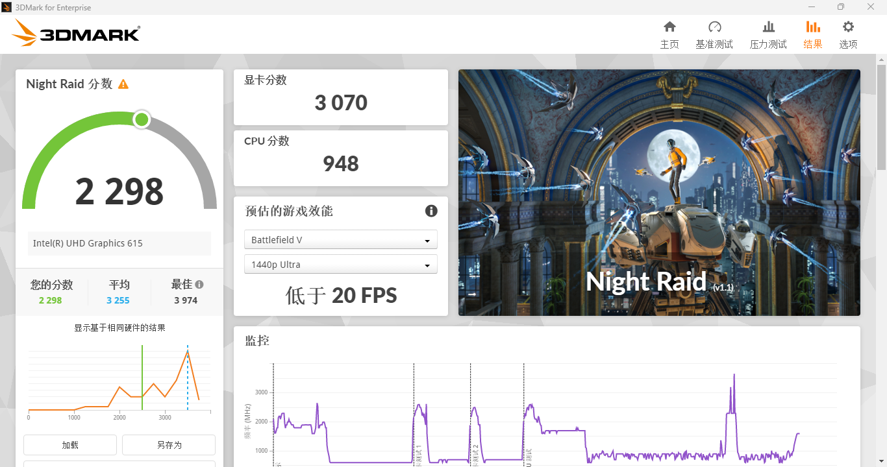

# 6.主观体验：老牛拉破车

这台机器上手后最直观的感受就是热。被动散热本身不是问题，问题在于它既没有把热量留在机身内部，也没有把热量均匀分散，而是集中在细热管和薄散热片上，最终直接传导到 D 面和用户腿上。更麻烦的是，系统似乎为避免烫伤设置了"拿起即降频"逻辑：一旦检测到机器被端起，频率立刻掉到 0.4GHz。保护初衷可以理解，但单手拿起就可能触发，实际使用中非常影响体验。原本 8100Y 的性能就不宽裕，再降到 0.4GHz，直接生活不能自理。

即便不触发降频，双核四线程超低压处理器的上限也摆在那里。2020 年四核 Amber Lake 已经发布，但受定位或主板兼容性限制，本机仍沿用旧双核方案，放在当年已经偏入门。到了 2026 年，搭配 Windows 11，开机、进系统和日常操作都明显吃力。同时这个机器的屏幕又小、分辨率又低，进一步放大了体验短板。有人会说这种尺寸配高分屏没意义，但后续 K12 机型用 12 寸 WUXGA 给出了反例，而且用户至少应该有选择的权利——毕竟这台机器起售价并不低。

这些因素叠加后，本机在今天只能算一个"能开机"的花瓶。性能弱锁死了上限，小屏幕又拉低了日常可用性。只是双核机还能勉强做文书处理，但屏幕方面的减配导致现在连文书机都当得不痛快。

# 7.总结：真的能吸引小朋友堕入Think的世界吗

体验完这台机器，很难不怀疑它是否真的是 K12 学习机的答案。孩子们可能只是想上网，但以这套配置，浏览器冲浪本身都成问题。它或许只会成为年轻用户眼中的过眼烟云，也很难承担起把新生代拉进 Think 世界的任务。

根本矛盾在于：一台定位上网本的机器，到了今天却上不了网。网页复杂度在这几年急剧膨胀，Electron 技术大规模普及，大量内存和 CPU 时间被消耗在无数 Chrome 内核上；而Chrome 自身越来越重，转向 Firefox 也不会更好，后者同样臃肿、也同样吃内存。K12 上网本的生存空间因此被不断压缩，直到出现如今这种几乎无法正常上网的窘境。更无奈的是，低端机的性能提升完全跟不上网页膨胀速度。除最高端产品外，无论是老古董客串还是各家新机，上网本的上限大多仍在 Amber Lake 类似物水平，最近几年这类机器陆续出现上网困难，实在令人难绷。

巧合的是，当年上网本衰落，性能也是关键因素。Atom 性能孱弱，连 Flash 都卡，直接带崩了产品线定义；再加上超极本兴起，把上网本当轻薄小电脑用的用户也流失了，以至上网本逐渐被遗忘。

至于这些"上网本上位、商务本下位"的小 e 编年史，就是后面要讲的故事了。