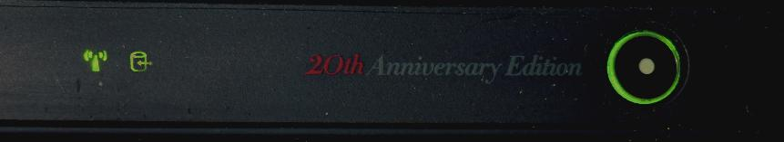

**ThinkPad Carbon 1st Gen——未来是你们的**

ThinkPad在2012年是混乱的。一方面，一堆Classic机器用老模具换六行键盘继续发光发热，群众基本上只骂换键盘，骂完嘛一边高呼"Ivy Bridge，板载；USB3，板载"一边爽买；一方面则是联想实验性的顶着Classic的字母开头搞出了一些ldeaPad水准的产品，甚至有T430U这种纯纯换皮扬天V490的产品，这些本子在12-13年间最终上市的时候自然个个被骂了个狗血淋头。幸好这些大多纯属病急乱投医的产物下一代就被砍掉了，不过某产品线用着这个IdeaPad类似物模具家族中最烂的那个（其他至少能用，这个甚至不能拿起来)， 结果恬不知耻的传了五代，连键盘都不换，这里不点名了；平板那边helix着实是不温不火，想法是好的可就是过于圆润实在令群众畏惧，Tablets 2倒是不圆乎乎的但是嘛Atom的性能又是拉一裤兜，S230 Twist又给的扣扣嗖嗖感觉不如X230 Tablet，总之雷声大雨点小。但是在这混乱的2012中有一台机器却无可争议的闪耀夺目，甚至昭示了ThinkPad未来五年的进化曲线，他就是ThinkPad X1 Carbon 1st Gen。

正巧我这正好有台除了处理器几乎全部项配的美版初代X1 Carbon和一台更换了国行项配主板的国行20周年纪念版的X1C，就让我们随着这两台机器回到2013，同他的前辈一起再次~~骗英特尔补~~打响商用超极本的当头炮。

**1.外观：自我突破，但又因循守旧**

我们一般认为ThinkPad的ID设计应该是设计成一个类似于黑色盒子，他的远房老祖X300系列、Ts系列和直系上代模具x1虽然可能在收边上会激进一些也都大体遵循了这么个设计思路，即使CS13其他的模具换了颜色（大多）做成了超极本也是类似一个灰盒子。但是ThinkPad X1 Carbon却将其抛于一边，可以说是将"自己最讨厌的样子"学的淋漓尽致——激进的边缘收边使得其看起来就像一双筷子，犀利但不失亲和感。这种设计虽然有立志作为超级本排头兵的原因， 但是确实实现了自我突破。

虽说身为"高贵"的超极本，大多同伴都学习苹果的"少就是多"的哲学砍掉那些代表着旧时代的灯号，但是在非触摸屏机型中，我们确确实实在A面看到了两点绿灯，和许多ThinkPad的旧机器类似。而C面则保留了更多的灯，至少不少于x230。略感可惜的是A面的这点灯在触摸屏版的机器上去掉了，事后诸葛亮的看给人的感觉就是孩子在成长过程中继续褪去那种青春的羞涩，虽说确实不知道孩子会长成什么样，但是依旧值得尊重和祝福。

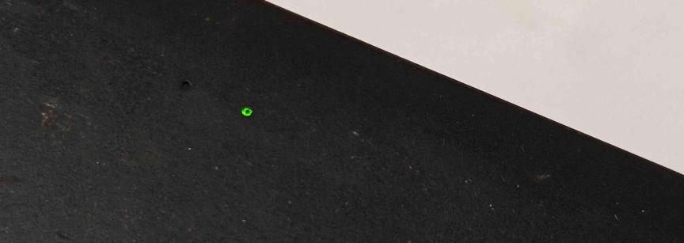

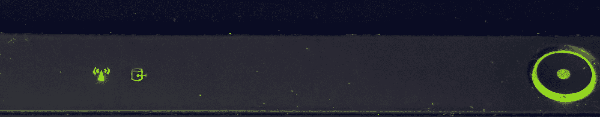

同时我们很容易的就可以注意到单独的音量键和黑色按键，这对于各位ThinkPad用户来说无比熟悉但对于超极本用户算是新奇玩意。相比较于使用Fn快捷键来说，这么设计不仅有效利用了屏轴之间的空间，还提高了反馈感，并且为更多的Fn功能键空出了空间。这个在后来的本子上被拔掉私以为是无比可惜的。

而我这台20周年纪念版的X1 Carbon相比较于对于新时代的展望，更像是某种旧时代的告别。回车键和ThinkVantage键那一抹蓝色是从许久之前一直传下来的设计语言，但是本世代的机器出于统一性的目的毅然决定全部抛弃，但是谁都知道情怀值钱，于是中国区联想就搞了这么一台换了一点东西的ThinkPad纪念机。虽说按照一些早期工程机图片来讲蓝色回车在E系列滥觞时本来没打算砍掉，蓝色ThinkVantage按键的六行键盘也实打实做出来一批装在了送测工程机上，但是到消费者手上切实是一个都没有了，而且这两个设计也没有同时出现在一个机器上，这台机器成为了孤岛键盘时代能集齐这两个元素的唯一机器。有一个只有摸到机器才知道的点，就是这台机器的ThinkVantage蓝色按键的塑料里面是有闪粉的，和X1是一样的，而不是其他机器一样的只用了一个简单的蓝色。如果有人希望在自己的机器上还原这个小元素，需要注意。

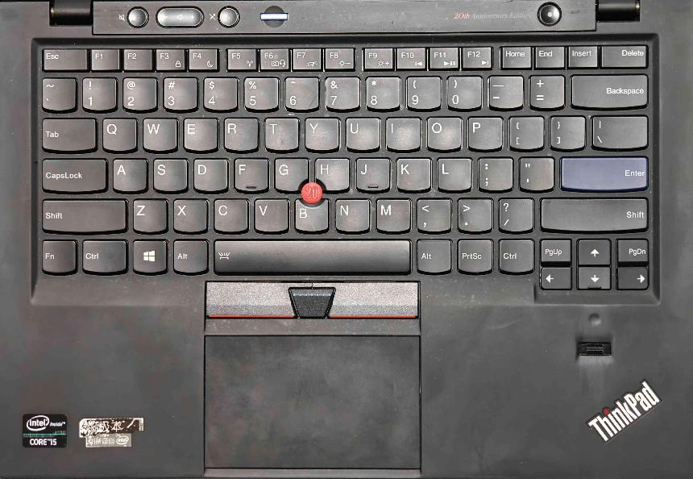

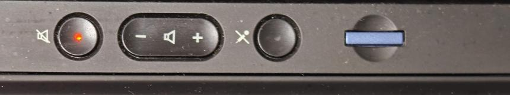

**2.接口：究极大缩水，无坞可用的尴尬配置**

为了追求所谓的最轻最薄，这台机器相比较于同期自己家的不少机器提供了更加捉襟见肘的拓展性。

左侧是方口电源口，出风口，USB 2.0接口和无线通讯硬件开关

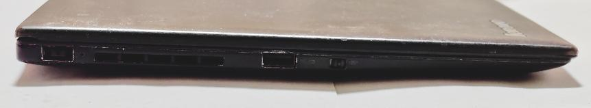

右侧是USB 3.0接口，Mini DP，耳机孔和SD读卡器

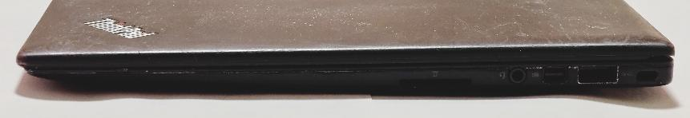

另外机身背部有一个Sim卡槽。

这个拓展性放在当年来说一定是不及格的。高达两个USB口，其中还有一个2.0，这个配置以目前的眼光来看实在是寒酸，即使说大家都干了但是还是令人有点不太舒服。同时这机器作为12年的Think机器，没有给HDMI属于意料之中但又会令不明真相的各位痛骂的，毕竟这机器也不是下贱的E系列，HDMI这种家用属性拉满的设计那时候确实不入法眼。至于底座拓展坞？你的那个接口就和机器差不多厚了，X1的外挂电池模组又缺乏优雅，就不要想着这些了，好好的享受USB 3.0拓展坞吧，毕竟配合DisplayLink也能视频输出，就这样吧。当然个人感觉最痛的是这机器居然没给雷电，虽说雷电在第三代之前一直是一个小众标准但是旗舰机给了就意味着一种可能，在T430s核显顶配给了雷电之后更显得眼见不足。

而在内部拓展性上，该机也成为了首款内存全部焊死的现代ThinkPad蚌壳本，而且内部大量采用了非标准零件。借用NotebookCheck的评测拆机图，可以看到硬盘，WLAN网卡和WWAN网卡全是非标准件——硬盘和WLAN使用了私有的NGFF接口，而WWAN使用了半高mini PCIe接口。虽说这样的设计较为有效的控制了主板的投影面积，但是也给选配和升级带来了无穷无尽的麻烦——固态硬盘有转接卡还好，两张网卡可是一点都不能换，要拿WWAN槽装固态还得找个半高SSD再改电阻，更难受的是在其他机器上Gobi 4000甚至5000大放异彩的时间点这机器只能用一张完全没有升级路径的半高Gobi 3000被留在了3G时代，这样子的搭配也显得不够旗舰。

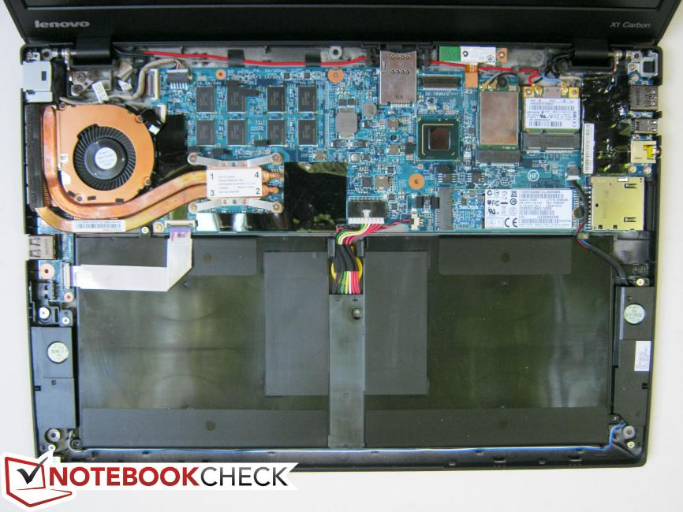

**3.屏幕:高端TN也是雪，边框设计很巧妙**

为了把这个问题讲清楚，我认为还是要回到2012年这个时间节点讨论一下当时的笔记本屏幕的问题：从分辨率讲当时常见的配置是12.5寸配768p屏幕，14寸配768p或者900p屏幕，15.3寸在低端机依旧768p的大背景下，高端机器一般会选择900p或者1080p。而从LCD的材料来讲，此时在12.5寸这个尺寸联想定了一批IPS屏，而15.3寸作为移动工作站的下限各家也是卷出了花，HP和戴尔有10bit 100%Adobe RGB的超级豪华IPS,Apple更是有视网膜屏这么个酷炫吊炸天的玩意，不过联想也好歹有一块友达v4这么个高色域TN，虽说比上不足但是比下绰绰有余……然后14寸这个市场就这么被遗忘了,各家基本上都是拿着几个垃圾屏用来用去,可谓绝望。

至于X1 Carbon Gen1,联想为了把这台机器做好确确实实花大价钱定制了一块在当时水准极佳的HD+屏幕，可惜的是这块屏一边分辨率还是900p一边又是大TN，以现代标准一看就倒胃口。那么这块屏幕究竟怎么样？

当你正对着这块屏幕的时候，你其实挑不出太多的毛病——这块屏标称72% NTSC色域，300nit亮度，整体观感虽说还是很TN，但是观感来说还是比较舒适的，没有那么发黑发白，甚至左右看整体的色彩保持度都挺好的，相比较于同期的那些正面看就没法看的屏幕来说那可是重大进步。

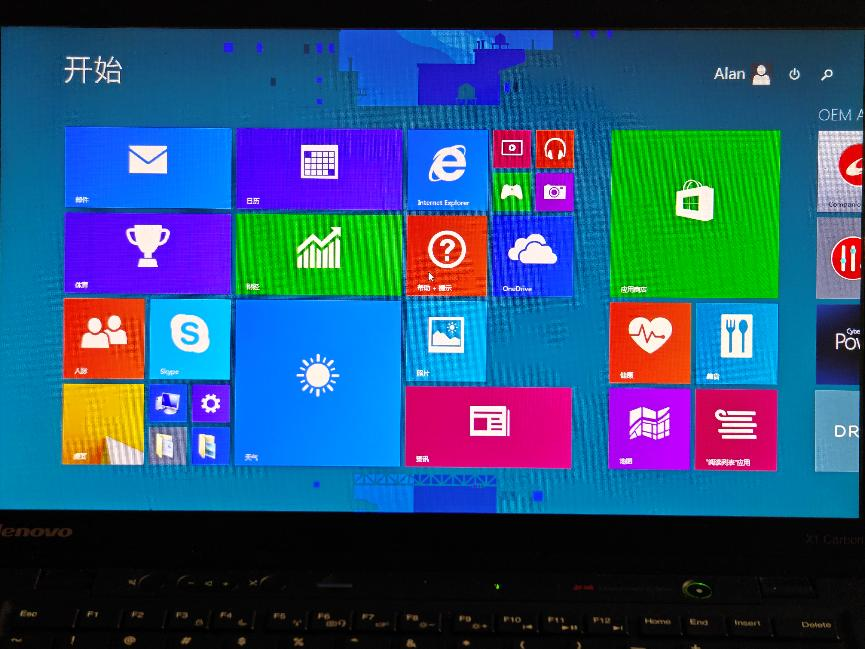

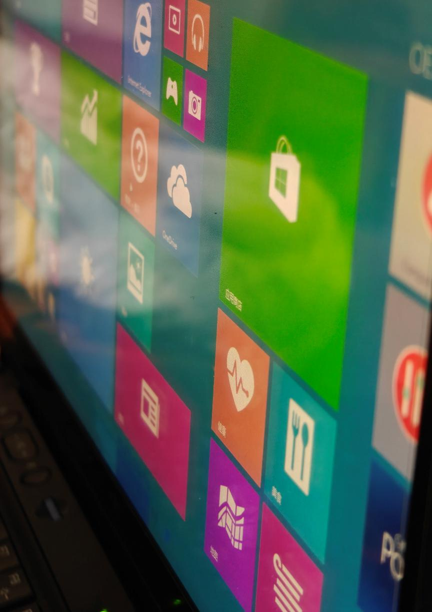

但是这毕竟只是一个WLED的TN，稍微上下转动一下视角就马上露馅，画面迅速的变得苍白或者发黑。显然的，WLED的TN屏的上限就在那了，再加上900p的分辨率也缺乏冲击力，于是这块屏仅在这款机器上用过，之后就迅速的被eDP的屏淹没了。

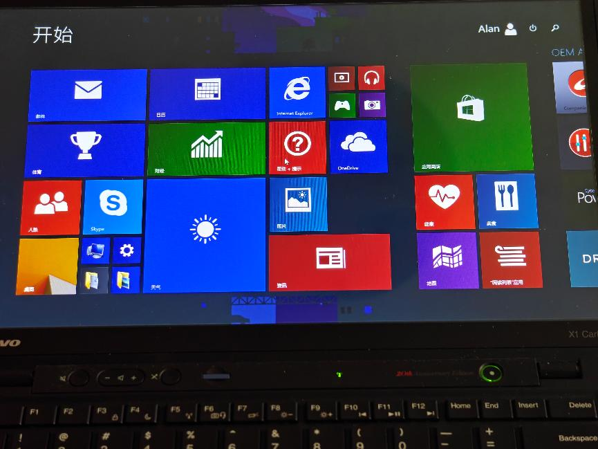

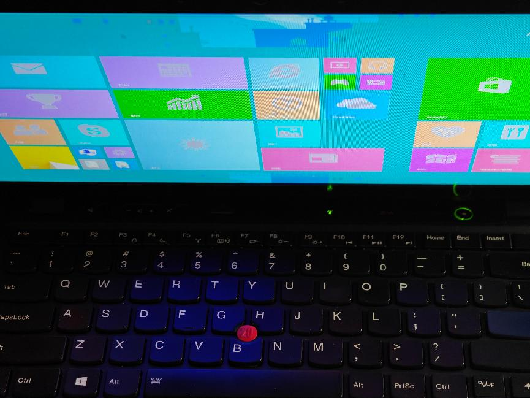

对于触摸屏版机器，最令人摸不着头脑的就是这机器的屏幕并非全贴合，可以很明显的看出来显示层和触控层是有一段距离的，观感显然不如全贴合的机器。但是考虑到全贴合的Helix和Tablet 2漏胶灾情堪称灾难，或许保留一点空气牺牲一点点观感保证长期可用性的策略是正确的。

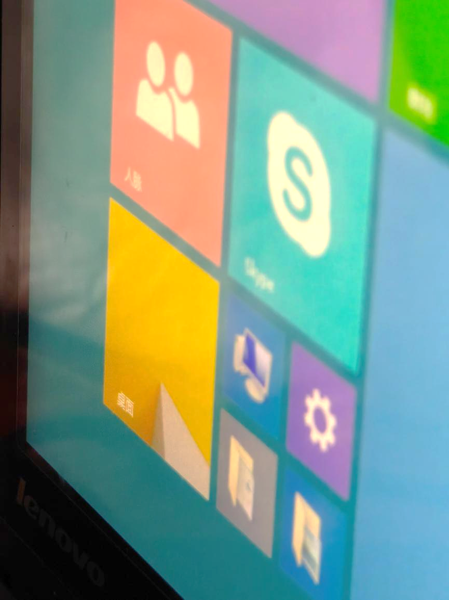

总而言之，联想这块屏代表了当时的dcWLED背光14寸LVDS宽屏的最高水平，但是无论是向前看当年的灯管屏还是向后看次年的那些eDP屏甚至自家的15.3寸友达v4都缺少竞争力，实在是有点生不逢时。

有了屏幕，如何装在机器中也是一个问题。本机做到了在当时来看视觉上比较窄的边框，左右大约1cm，顶部底部可见边框约2cm。本机率先采取的一个行业通用的讨巧法子是适当的压减底部宽度，利用下沉轴隐藏一部分边框，适当的加厚顶部，使得最终产品视觉上协调，没有大下巴感。最鸡贼的是大和的老登玩了一手视觉错觉，通过装饰条的切割和Logo的下移成功营造出了这款机器的下巴比后代还小的错觉，这么巧妙地安排在后续机型上没有保留实在是有点可惜的。

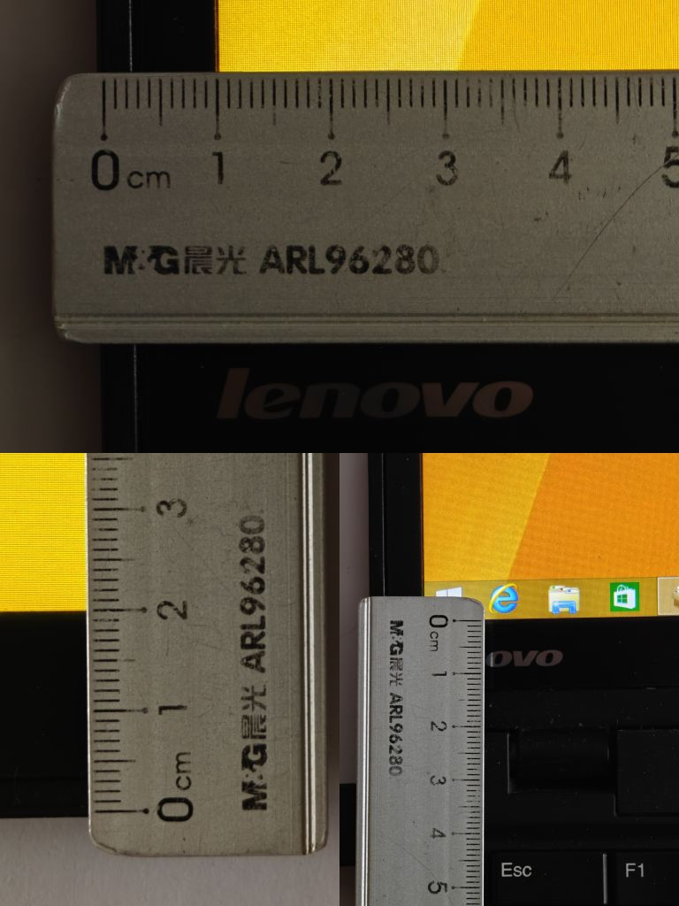

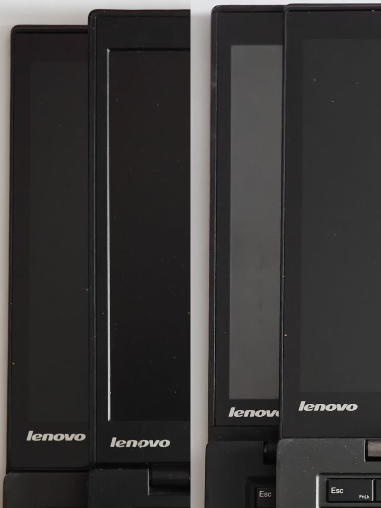

**4.键盘:思考的光芒从下往上，功能键区承前启后**

让我们和可以当灯用的Thinklight说再见吧——轻薄本已然没法美观安稳的塞下一个灯了，T430U那种丑陋的设计完全是病急乱投医，背光键盘才是新时代的优选。

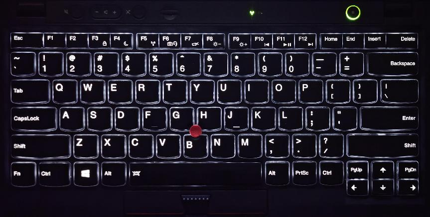

这已经不是ThinkPad团队第一次做背光键盘了，X1和30世代已经检验了他们的能力。从图片中我们可以清晰地看到这个键盘的背光整体均匀明亮，已经和现代的背光键盘没有什么大区别了。

由于本机的设计，我们还有机会看看机器的键盘背光设计。可以看到其是由中间的九颗LED灯珠配合导光板打亮整个键盘的，由于排线和指点杆的限制并没有安排在最为靠中间的位置，但依旧是极力的追求打光均匀，最后的效果呈现也很好。

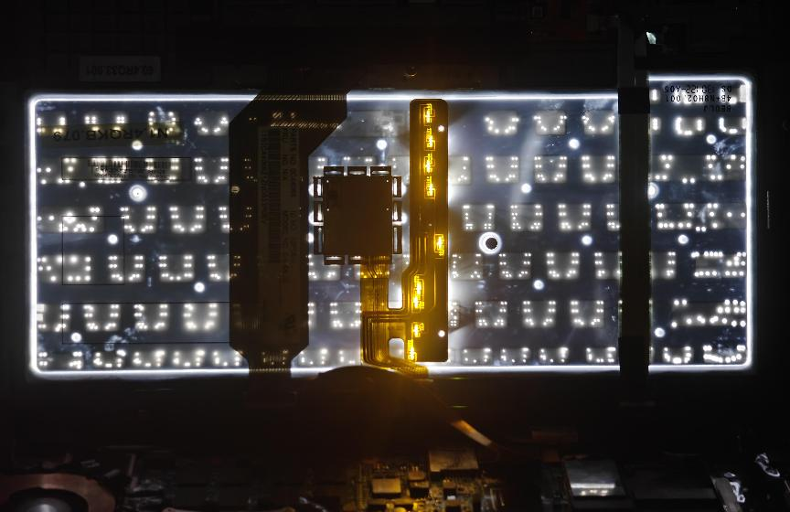

如果仔细研究这个键盘的功能键区域，你会快捷键布局和X230等机器的键盘完全一致，但是键之间的空隙堂堂回归。聪明的你肯定明白这么设计的好处——利于盲打，更加美观等。

回归到手感上，本机的键盘在加入了背光的情况下依旧保持了ThinkPad的一贯的手感，绵而有力，很多时候恰到好处。至于广大用户津津乐道的厂家区别，我手上的两台机器都是群光出品，不是光宝有点遗憾，手感上依旧有其所存在的缺少一种微妙的支撑的问题。

**5.触摸板和指点杆:丝绸般顺滑，谁都用着舒服**

ThinkPad长期以来一直都是塑料触摸板的忠实爱好者,一直致力于塑料触摸板的技术演进，即使到了今天依旧坚持在最高端产品上为用户提供塑料触摸板。但是对于自己的超旗舰来说，还在用塑料似乎有点掉价了。于是乎联想在这款机器上祭出了ThinkPad家族史上的第一款玻璃触摸板。

本人对于ThinkPad的玻璃触摸板评价颇高，认为这堪比摸美女丝袜，和塑料触摸板完全不可同日而语。虽说这块板子在"丝袜目数"上还是高了点使得感觉上还没有那么丝滑，但是依旧很令人舒适，相比较于现在许多的那些连文字选中和拖拽都做不明白的触摸板，这块当时最大的ThinkPad触摸板已经很好了，ThinkPad的这第一块玻璃触摸板就已经有了如此成绩实在是令人欣慰。

指点杆就是最传统的ThinkPad指点杆。并不是隔年的那些变矮过的指点杆。好消息是这个指点杆依旧支持拍击等传统艺能，坏消息是因为是旧的指点杆，驱动程序也是旧的，而新思的旧指点杆触摸板驱动的设置界面挺复杂的，用起来还是不太舒服，而且缺少完整的Windows 10的精准触摸板手势模拟和对于这些手势模拟的设置选项，但是依旧保留了许多祖传设置项，在这么一块已经很现代的触摸板上用那些老手势确实恍若隔世。

而作为纪念机，20周年纪念机的指点杆采取了一个特殊的设计——使用了一个有着"20"字样的指点杆帽。其实这个指点杆的手感还是挺好的，不像一般的指点杆那么刺手。

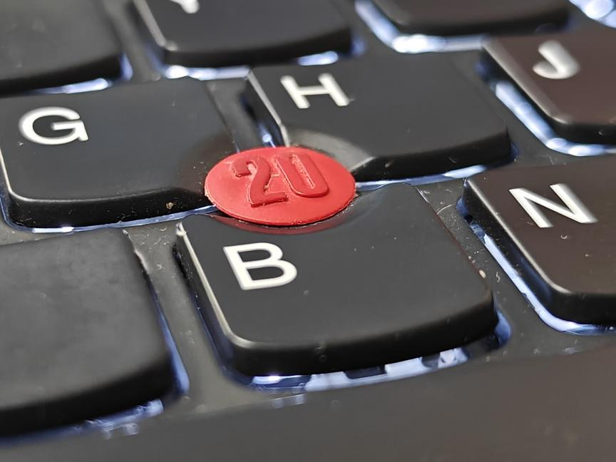

**6.性能与体验：凑活能看了了**

至于这台机器的性能，说实在的放在现在也就是乏善可陈。接下来以3667u为例，来简单的介绍一下这款机器的性能。

i7-3667u，IvyBridge架构下最高端的低压处理器，TDP为17W，基准频率2.0GHz，单核最大睿频3.2GHz，多核最大睿频3.0GHz。

用CPU-Z测试，我得到的结果是单核230、多核702，看起来是一个平平无奇的分数。凭借高频率和Intel的挤牙膏，其性能接近于5200u，放在现在做一些轻度的工作还是不在话下的。

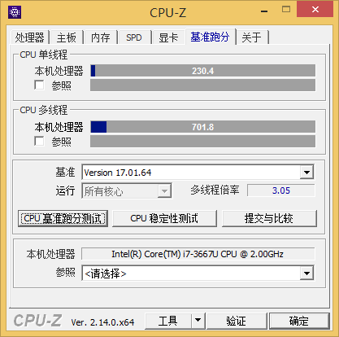

7Z压缩解压得分为11654分，强于6200u，略逊于6300u。3667u凭借着高频将将和数年后的低一点频率的Skylake打平，不知道是该高兴还是该悲伤。

我还跑了一下3DMark06，结果是5643分，整体还凑合。

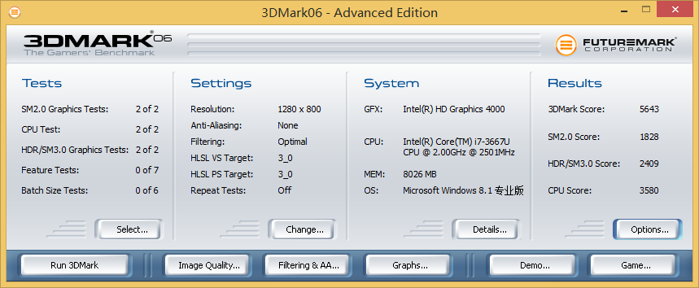

总体来看，本机所提供的性能在当时来看也算是整体较好的，肯定是没有那些四核怪物那么强劲，但也是当年低压本中的翘楚了。

**7.8G内存和SSD:可供现代使用的关键一招**

对于一个内存焊死的本子来说，你焊上去了多少内存确实是产品生命周期期望中极其重要的一环。坏消息是这台机器有海量的4G版流通，甚至国行的20周年纪念机都是4G内存；好消息是你能选8G，相比较于只有4G显然是不知道高到哪里去了。一想起2022年还有厂商在卖焊死4G内存的机器而十年前8G早就成了高端机的一个受欢迎的可选项我就想笑。

另外一个重要的点是这台机器采用了全SSD配置。从X300开始ThinkPad可以选配SSD，但是即使是1.8寸机器依旧是给了一个东芝机械盘的选项。从2008到2012，固态技术终于发展到了足够装下整个工作环境的最低限度了。于是我们就看到这款机器采用了全SSD配置，使用了最小120G最大256G的闪迪或Intel的定制SSD。和同期的机械硬盘相比这个容量实在是小不点，但是确实，这个容量已经可以用了，加一块机械硬盘只会给自己添堵。

**8.总结:承上启下标兵，2012最强Windows超极本**

或许大家会怀疑为什么我对于这台从今天的眼光来看在整个家族系列中没那么惊艳的机器给了那么高的评价,我想主要是因为这台机器在面对时代浪潮做出了适当的改变的同时也保留了ThinkPad不少的最优秀的品质。

当时超极本化浩浩汤汤不可阻挡，传统商务本已经在完蛋边缘摇摇欲坠。不做出改变既要被市场改变,大和的日本佬一边半推半就试图两头讨好(结果由于种种原因确乎是大失败了)的同时借着超极本定义中的一些有趣部分做着许多确实存在趣味性的设计,一边也在满怀傲气做着这么一款可以说是给各家打样的旗舰超极本。虽说隔年他们就自己推翻了自己打的样做出了一款惊世骇俗的机器，同时初代X1 Carbon的许多设计并没有被延续下来（比如前面提到的该机是和传统的X系列一样采用D壳承力，此后采用如此设计的机器真的寥寥）但是其依旧是树立了一个旗舰的标杆。

我固执的认为千禧年后ThinkPad的最辉煌的时代还是在联想收购后直到12年底X1 Carbon发布。两位数时代大和带领联想爽吃IBM遗产做出了比IBM时代更好的机器，此后大和在联想手下做出了超越想象的X300系列和CS08机器，大概是证明了自己不用吃IBM尸体也能做出好机器。那年头的ThinkPad除去X1的小小挫折和E系列的"德不配位"以外简直是高歌猛进，初代X1 Carbon也是超级本的终极标杆……自初代X1 Carbon后，世风日下，超极本横扫市场，大和在砸自己招牌的路上越走越远，虽有偶发爆种但除了X1 Carbon和P1外的机器总体还是不甚高明。当时间来到2025年，Intel平台的E14展现出了大陆团队从21年开始一路狂飙式成长后的水平（AMD平台的还是受制于定位问题始终给你一个令人难受的地方，这大概算行业共识），PRC Only的T14p已经被海外行拿来主义略微加强外壳换专业卡毙掉2242后用于P14s，同时X9-14和X9-15两个不用背ThinkPad包袱的离经叛道产品的惨烈对比（国内团队做的X9-15屠杀了大和搞的X9-14），再加上今年X14这种名作之壁的闪耀表现，我最终还是确认了一个我心里已经清楚的事实，大概大和确实是没落了……