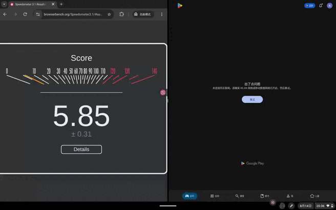
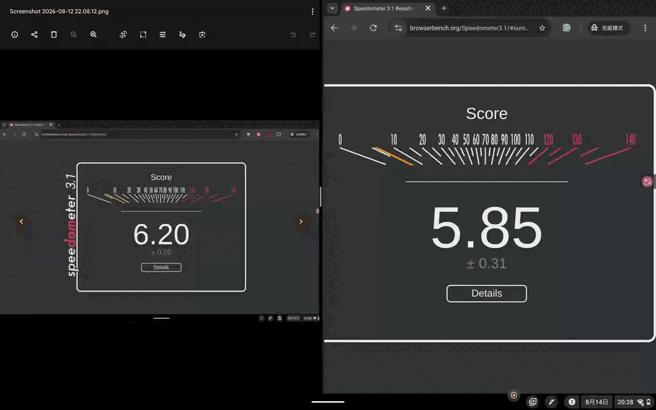

---

title: 你们真的没插键盘鼠标用过自己的产品吗？——Lenovo Chromebook Duet11 M889激情体验

date: 2026-08-30

order: 3
---

长期以来，本人一直很抖M的坚持拥有一台仍在更新系统的ChromeBook，倒也不为了什么，就是为了方便领略这么个抽象系统的风采。今年随着我一百多买的推土机本子的常规更新寿终正寝，我也得张罗一下搞一台机器来替换掉原先的机器了。

本来我是想搞个迅鲲500的板子的，希望能够以最低价格吃到2030年的系统支持，还能赌一波Aluminium OS，然后我悲伤地发现这些机器相比前几年并没有降价多少，这种半电子垃圾水平的机器还卖两三百实在是令人不解。同样的骁龙7c的机器也高高在上，卖的比同配置Windows机器还贵真的是活久见了。正当我苦恼时，看到奸商手上一批Lenovo Chromebook Duet11 M889工程机，299买4+64的迅鲲838板子，唯一的问题是喇叭没声音。迅鲲838那可比迅鲲500骁龙7c这些杂鱼强多了，如此天赐良机我怎能不争取，于是就直接拍下。

到手后我自然是欣喜的，但经过一段时间的使用，我才明白为什么各家出平板形态的Chromebook时都要加个键盘套。今天本人就作为一个愤怒的用户，狠狠抨击一下谷歌在平板形态Chromebook上的摆烂态度。

**1.外观：低端公模**

作为一款入门级平板，这台机器的外观平平无奇。但是作为工程机，其仍然会给我们带来点惊喜。

正面就是平平无奇的低端平板外观，塑料支架高耸，四边基本等宽，内屏做了圆角。这里用的是官方渲染图。而工程机总归是要有点特殊的，那就是屏幕左侧的一行小字：Sample not for resale。

而我这台机器的背面就有的说道了，毕竟是工程机，会搭载许多不会上市的方案和配置，比如我这台的背部就和量产版不同。

上面这是正式版的外观。

这是我手上这台工程机的外观。显然，工程机时代居中大Lenovo的元素就已经定下了。但是分色设计和MaxxAudio调谐之类的元素要等到后面的批次才有。类似的还有相机Deco上的参数和细节处理之类的小细节是要日后去细化的。机器上还有联想工程机常见的配置一览表。（虽说这机器大概是因为超级拼装出来的机器导致配置表完全是错的）

总体来看，这个机器就是很一般的低端平板的长相，可以说是外观平平无奇的一般路过机器。

**2.性能与外围：联发科诚意之作**

我这台机器的主要配置信息之前已经讲过了，是4+64的机器。这里我给出设备信息的报告方便大家了解机器的参数信息（电池是系统的假数据，实际为29Wh，约3700mah），更具体的硬件参数信息大家可以自己去PSREF查阅。

迅鲲838，一款定位中低端的Chromebook芯片，配置如下图所示，看CPU规格可以归入天玑900类似物中，但是从GPU配置中可以清楚的看到这芯片是单独开的。具体的参数可以看下面给出的表格。

说实在的，这个芯片的性能相比较于迅鲲500来说有了一个质的飞跃。在大家都吃ArcVM虚拟机损耗的情况下，Notebookcheck跑geekbench6的成绩大概是2291分，基本符合这个定位的处理器的分数，迅鲲500则大约为1214分。同时我也测试了一下原生环境跑7z的成绩，结果是19023分，接近845的水平，同样的环境下迅鲲500大约为14628分。作为一个主要以浏览器为主的设备，我还测试了一下speedometer 3.1，取得了6.20分，似乎略逊于7200u。

相较于先前的那些联发科平台Chromebook平板，这款平板的外围也有了一些有意思的提升。最明显的就是两个C口，且均为全功能USB-C。虽说按照联发科的文档这SOC就一个3.0接口，也不知道谷歌和联想是花了什么奇技淫巧搞定的。既然是全功能C，自然的，这机器也有外接高分辨率显示器的能力，官方标称3840x2160@60Hz。

另外一个有点意思的东西是这机器的前置有一个遮罩，在不想被拍的时候可以遮起来。但是不知道是因为技术原因还是就是为了省钱，这个遮罩并不能实现Windows设备上常见的自动断电功能，而只是一个物理遮罩。于是你是能够用这个拍自己的半张脸的，Windows设备那种划拉到一半时一般已经断电了。

总体来说，整套平台作为一个中低端的Chromebook是合格的，完成互联网浏览是完全没有问题的。

**3.ChromeOS的平板体验：完全的灾难**

整体来看，这个板子其实硬件上还凑合，总体稍强于国内最低配的平板，还有一些亮点，也确实这机器在硬件上并没有给我很差的体验。但是真的将我引爆的还是ChromeOS。之前我用的都是带键盘的设备，在这些设备上ChromeOS的体验整体来说还算可以，但是这回我并没有同时得到这款机器的键盘盖，自然的我的体验就长期的卡在了平板模式下。也是只有在这个环境下，我才真心感受到了谷歌对于这个系统的不上心。

首先第一个问题就是动画设计诡异。老生常谈的打开控制面板没动画关闭有动画就不提了，看似平滑的后台界面动画也有幺蛾子，首先就是你上滑时应用卡片没有防抖，要是你卡半路上了就会看到你的窗口在手指边上来回抽搐。然后就是当你开着应用的时候，只要把应用拉起一定高度松手就能进后台了，但是从应用抽屉进后台需要你刻意的停止一段时间，伴随着抽屉遮罩的消失和后台遮罩的出现，怎么看都令人感到怪异。最后当分屏的时候，谷歌采取了一个怪异的按分屏界限切割手势区域的诡异设计，这就意味着如果你下意识地去扒拉小横条，你可能难以预计你究竟会带起来哪个窗口。

然后的问题就是操作逻辑神奇。其中一个每个人都会遇到的问题就是在运行安卓应用的时候，分屏控制面板极其难以拉下来，经常是急头白脸的拉半天，面板都是只露一点点边就是拉不出来。

即使你用的是后台界面的分屏，你必须点进一个应用才能分屏，分屏样式仅限三档可调，做了分屏应用进后台的动作就会丢失分屏布局的诡异设计不知道大家满不满意。

接下来赶到的是只能右滑返回不能左滑返回，这个倒是很Chrome，毕竟在Chrome下你左滑是向前，但是当你在用ArcVM时还是只能从左边返回的时候就有点难受了，你要学苹果教用户做事？同时平板模式还强制显示应用抽屉，主页就是应用抽屉实在是剥夺了各位的选择权和欣赏壁纸的权利。最后我要提一个最离谱的点，这系统按电源键只能关闭屏幕不能锁定，你下次按电源亮屏，等个几秒钟（没错这玩意亮屏还要等几秒）发现不是锁定界面，而是你离开的时候的样子。这可能能方便一些人的工作流吧，但是隐私这块就完全没有了。

再接下来的一个问题就是ArcVM实在不舒服。作为虚拟机，其固定的占用大量内存，相比较于之前的容器方案性能拉跨（即使现在经过长时间的抢救有了起色也难掩颓势），而且即使占用了这么多内存依旧难掩海量4G内存机型出货环境下的内存紧张情况，基本上留不住后台。而且我们我们会注意到这个ArcVM在冷启动的时候先加载个半分钟，再在开屏Splash卡半天，体验实在说不上多好。最后一个问题就是你折腾半天也就安卓13呀，隔壁华为已经Android 16呀，你咋连华为都赶不上，被英特尔的转译卡脖子了？或许这些在我买更高性能的Chromebook时会迎刃而解，但是你谷歌既然拿出来这种性能和配置的产品供消费者选购，就应该让消费者在使用你内置的功能的时候有一个起码舒适的体验，而不是把产品做的可用性堪忧后提起裤子不认人。

最后一个令人意想不到但又情理之中的问题出在了输入法上。ChromeOS的输入法向来为人诟病，只是没想到它的软键盘完全就是从手机Gboard上Copy了一下然后加了点自己的小巧思，没有给出自己的解决方案，也没有给出丰富的设置选项，更没有做哪怕一点的平板适配，还能稳定出如下图的Bug。哪怕你能做到Gboard水平，给个拆分式布局方便双手捧着打字我也算你努力过了，就不求你像真文韵一样做个PC键盘布局了。

**4.总结：求求你快点推Aluminium OS吧**

由此，我们可以达到一个结论，就是ChromeOS的平板可用性实在不佳。客观来说，出现这种情况并不是联想的锅，而是谷歌对ChromeOS平板形态的投入不足导致的。

好在谷歌现在准备精简一下手上的系统产品线，准备搞Aluminium OS，从而抛弃掉现有的破败不堪的，没有原生应用的，Arm平台的大量驱动需要谷歌自己来逆向的ChromeOS平台；更换成新的，拥有可以受控的原生应用环境的的，不用和各种闭源驱动做长期斗争的Android平台。整体来看这是一个喜忧参半的决定，换安卓意味着更多的可能以及现成的一些平板适配（即使实际上还是不够多，但也比ChromeOS那个容器强），对于性能适中的设备来说，原生Android自然可以大幅提高运行Android程序的效率。而悲哀的是，ChromeOS在不开子系统的情况下其实对低端配置很友好，换用Android后，那些低端机的处境就难说了。

不过对于迅鲲838来说，性能并不是关键问题，类似性能的手机平板跑Android也算基本顺畅，整体来说平台也比较新，要我说它正好是适合于换Android的。迅鲲838的问题是跑原生Android是可以顺畅的，但是跑ArcVM正好有点卡顿。换用Android后能够提高Android环境的运行效率。

ChromeOS设备的高端化一直以来是一个超级难题，大家都不愿意相信这么一个浏览器系统值得上高端平台，基本上上个酷睿处理器都要被嫌弃浪费芯片。但是现在问题已经恶化到中低端设备也会被人惋惜搭配这么个系统糟蹋芯片了（即使理由会有点不一样），似乎现在是做切换的最佳时机。但是现在的GoogleBook似乎在往一个高高在上的方向狂奔，低端设备目前还是前途未卜，这实在不是一个好兆头。谷歌是继续坚持给低端用户缝缝补补ChromeOS的破船还是破罐破摔全上Aluminium OS还是值得拭目以待的。

